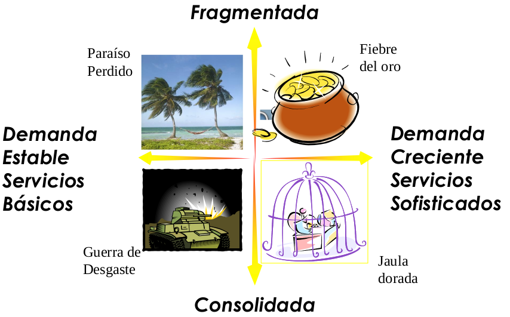

# Administración de organizaciones

- Productos Termoformado: http://www.pro-te.com.ar/tecnologia.php
- Paso a paso restobar: 

## 1.  Martes 29/9/20 - Teoria de la organización

### Partes de la organización

- Apice Estrategico (AE):
    - Establecer vinculos con los entornos
    - Desarrollar la estrategia de la organización
    - Ejercer supervisión directa.
    - Tomar decisiones.
- Linea media (LM): Operacional
- Nuclero Operativo (NO)
    - Transformar insumos en productos.
- Tecnoestructura:
    - Normalizar procesos, resultados y habilidades.
- Staff de apoyo
    - Propio sistema de toma de decisiones.
    - Normalización de resultados, hacia la organización.

### Mecanismos de coordinación:
#### a. Adaptación mutua: 
- Organizaciones simples o muy complejas sin experiencia previa.
- Es horizantal.
- Ceder - adaptarse - Coordinar.
- Cerca del problema y la toma de decisiones.
#### b. Supervisión directa
- Las decisiones se toman en un solo nivel.
- Centraliza las decisiones
- Lo opuesto a la normalización de procesos.
- Puestos sencillos en el nivel inferior.
- Sube información y bajan órdenes.
#### c. Normalización:
1. de habilidades
    - Su habilidades han sido adquiridas antes de ingresar a la organización.
    - No requiere supervisión u ordenes de detalle para la ejecución de tareas.
2. de Procesos
    - Secuencial: Linea de montaje.
    - Paralela: Fábrica de mesas.
    - Reciproca: Embotelladora de bebidas.
3. de resultados
    - Aquellas organizaciones donde otro tipo de coordinación dificultaria las correcciones necesarias.
    - La conducción asigna los recursos, establece las politicas y objetivos, superando los resultados.

#### Resumen

## 2.Viernes 2/10/20: Pestel y Transformación digital

> Análisis sistemico de una organización: Organización como sistema para adentro y para afuera.

### Acronimo [VUCA](https://blog.liderarte.org/vuca-que-significa/): 

- _Volatil_: Cambios constantes, rapidos y significativos. Ejemplo: Precios que suben y bajan. Tendencias que se revierten.
- _Incierto_: Presente poco claro y resultados impredecibles.
- _Complejo_: Muchos factores a analizar para la toma de desiciones. 
- _Ambiguo_: Falta de claridad sobre un evento o dificultad para entender la situación actual

### Analisis PESTEL

Es util por cuatro razones:

1. Ayuda a detectar oportunidades de negocio o personales y tambien alertar sobre amenazas.
2. Devela la dirección de cambio dentro del entorno del negocio. Muestra lo que se esta haciendo para trabajar con el cambio y no en contra el del cambio.
3. Evita empezar proyectos que podrian fallar, por razones fuera del control de uno mismo.
4. Ayuda a liberarse de suposiciones incocientes cuando se entra en una nueva región o mercado, debido a que se desarrollo un punto de vista objetivo de nuevo ambiente o entorno.

#### Como utilizarlo?

1. Paso 1: Realizar un brainstormin de los factores:
    - Politico: 
        - ¿Cuando son las siguiente elecciones? ¿Como podrian cambiar las politicas del gobierno o la región?
        - ¿Quienes son los contendientes mas probables al poder? ¿Cuales son las politicas de negocio o otras politicas que pueden afectar a la organización?
        - ¿Hay una legislación o impuesto pendiente que puede afectar el negocio, positiva o negativamente?
        - ¿Como las regulaciones pueden afectar el negocio? ¿Hay una tendencia a regularizar o desregularizar?
        - ¿?
- Econonomia: Inflación, Costos de vida, Horas de trabajo, Desocupación.
- Socio culturales: Tendendias de los consumidores. Temas eticos, Balance de vidas, Habitos.
- Tecnología: Transformación digital y como compiten. Como responde a las nuevas tecnologias.
- Legislación: Antimonopolio, Derecho internacional, Regulaciones, cambios en la legislación que afectan al empleo.
- Ecología: Influye en los consumidores, y el proceso productivo.
- Analisís a nivel local, nacional e internacional.

Luego de realizar un brainstoming de los factores

##### Referencias

- [Pestle MindTool](https://www.mindtools.com/pages/article/newTMC_09.htm)
- [Pestle](https://www.cipd.co.uk/knowledge/strategy/organisational-development/pestle-analysis-factsheet)
- [Ejmplo Pestle](https://www.cipd.co.uk/Images/7583-PESTLE-example-retail-industry-2020_tcm18-27108.pdf)

#### Economia digital

- El cambio: 
- Describir mundo: 
    - Los cambios tecnologicos es mas veloz en lo tecnologico.
    - Los mas rapidos se comen a los mas lentos.
    - El mundo es _VOLATIL, AMBIGUO, INCIERTO, COMPLEJO_
- Cambios Politicos: Debido a la Globalizacion, se dan muchos cambios de dirección
- Cambios Economicos: America del sur aislada del mundo.
- Cambio Social: Aumento la esperanza de vida y hay mas gente retirada y menos trabajando.
        Diversidad, Sindicales, El comportamiento de los consumidores es mas complejo.
        Culturales, Sociales, Psicologico, Personales, comprador.
- Tecnologico:...
- Legales: Mayor regulación para los Direcivos.
        Gig economy: precariza los empleos como Uber y Glovo. 
        Regulación Fatca para regular cuentas.
- Ecologico: Salud ambiental
- Globalización: Libro: La tierra es plana (Toman Firzman)
    Poderes: paises -> empresas -> personas (ahora)
- Cuarta Revolución industrial.
Disrupción Digital: Revisar el Vortice Digital, es el ojo de huracan.
    La tecnologia generar la disrupcción y 
    La industria financiera sufre la distupcción
Tecnologia Distruptiva: (Se usan en conjunto orquestandolas.)
    Mobile, Cuantica, IOT, Sistemas Expertos, BigData y nube. 
    Robotica, Protesis, Autos autonomos. Impresiones 3D, Carne sintetica, blockchain.
    Lo que se viene: - Mellisos digitales, - Productos Customizados, Papel inteligente, nano medicina.

    Revisar Congreso de Garner y el  impacto en el Negocio
    El talento en el Mundo: Faltan taletos para los nuevos trabajos del mundo.

    Transformacion Digital con Personas, Tecnologia, y Procesos
    

    Estudio de We Are Social- Como avanza en el mundo con la tecnologia.

    No hay que ver la tarea, si hay que ver el pantallaso total. No mirar a corto plazo.

    Porque Cuestra la Transformacion? 
        Incentivos a cortos plazos, 
        ignorancia, 
        Silos, 
        Gap de destresa digital.

---
### CLASE: 6/10: TIM y Estrategia de los oceanos azules.

* **CIO**: Chief Information Oficer
    Cualidades:
        - Los sectores deben estar alieados y aplicar la técnologia.
        - Capacidad de liderazgo y motivación.
        - Conseguir mejor gente: Habilidades duras y blandas.
        - Capacidad de innovación
        - Saber Negociar

Tablero de control balanceado. Balance Scordcard(BSC).

    Imperativos Básicos: Tres objetivos que son independientes de la voluntad de quienes la dirigen.
        - Supervivencia
        - Crecimiento
        - Rentabilidad
    Estrategia: Habilita de utilizar los recursos inteligentemente.
    Gestion estrategica: Accionar

    Herramienta para la medición de performance organización.

        1- Financiera (Flujo de caja). Para satisfacer a los accionistas.
        2- Clientes: Satisfacción del cliente
        3- Interno: Mejorar los procesos internos 
        4- Satisfacción de los empleados: Mas capacitaciones y crecimiento.

        Personal mas capacitado genera mejores procesos, impactando en una mejora
         en la satisfacción de los cliente, un cliente mas satisfecho trae mas ganancia.

    + Dos altarnativas por caracteristicas
    + Indicar en las concluciones

    Bibliografia????

#### La estrategia del oceano Azul

_¿Como pasamos al oceano azul? Realizar las siguientes acciones_:

- Reducir: 
- Crear:
- Incrementar:
- Eliminar:

_Preguntar para ver si es un oceano azul._
- ¿Ofrece su idea una utilidad excepcional para el comprador?

Si es si.
- ¿Es su precio accesible para el grueso de los compradores? Si se apunto a un taget de cliente especifico, no se hace la pregunta.

Si es si.
- ¿Podra lograr su meta de costos con rentabilidad, con precio estrategico?

Si es si.
- Entonces estamos probablemente a un **Oceano Azul**

    Es importante analizar aquellos que no son clientes y tenerlos en cuenta como potenciales.

    Eric Ries - Lean Star up:
        Producto minimo 

### Clase 9/10/2020 - Penta Modelo - 6P
    Enfoque sistemico: Estudio de la organizacion genericamente

#### PENTA MODELO (Autor Alberto Levi)

    Pilares: 
        - Cultura: Formas de trabajo o politicas de la organización. Tienen que ver en como se hacen las cosas. Usos y costumbres.
            Ejemplo: Los mail se guardan por 5 años. 
        - Recurso: Todos los recursos: Personal, Financieros, Infraestructura, Tiempo, Información, Conocimiento.
        - Mercado: A donde apunta los productos. Que productos comprar, Que proveedores existen, como Negociar.
        - Gestion por Organización: Gestión intera. Relación entre sector. Tipo de supervicion. Revisar Autor Mintzberg.
        - Estrategia:

    Todos los pilares deben estar alineados con la Estrategia.!!

    Tarea: 
        1- Conocer la herramienta.
        2- Aplicar la herramienta relevando.
        3- Analizar la herramienta y verifica que pasa con cada uno de los puntos.
            ¿Para que sirve la herramienta?

#### 6P (Mercadotecnia)

Autores: Kotler y Druker en el area de mercadotecnia.

- Kotler: La mercadotecnia es una actividad humana cuya finalidad consiste en satisfacer
las necesidades y deseos del ser humano mediante procesos de intercambio.

- Druker: La finalidad es conocer al consumidor.

- Analizar el mercado, ver lo que necesita y visualizar el norte.
    - Cantidad de empresas: Alta o Baja
    - Diferenciación de productos: Alta o Baja

    Monopolio: Baja cantidad de empresas, Alta diferenciación de productos.
    Oligopolio: Baja cantidad de empresas, Baja diferenciación de productos.
    Competencia Imperfecta: Alta cantidad de empresas, Alta diferenciación de productos.
    Competencia Perfecta: Alta cantidad de empresas, Baja diferenciación de productos.

    Ayuda a ver a que mercado el producto esta orientado.

- Caracteristicas de las empresas:
    - Lideres (mayor participación relativa)
    - Retadoras (Se expanden agresivamente)
    - Seguidores
    - Encajonadas
    - Invasoras(Atacan con productos sustitutos)

- Comercialización:

    - **Vendemos experiencia**

- Las 6P
    - Producto: Bien tangible o intangible. Para un segmento determinado del mercado.
        - Atributos: Basico, Real,....
        - Caracteristicas: Se pueden analizar algunos productos
            - Producto Ideal: Zona 4 (Oportunidad)
            - Producto Real Propio.
            - Producto Real Competencia.
        - Relacionado con **Boston Consulting Group y Matriz de Pareto** y se utilizan para poder elegir los productos mas importantes a analizar con el diagrama de caracteristicas.
        - Ciclo de vida: Para ver en que etapa esta un producto, utilizar **Boston Consulting Group**
            - Embrionario
            - Crecimiento
            - Madurez: Tiene un punto de camio tecnologico.
            - Envejecimiento
    - Paquete: Se analiza el empaquetado del producto, la marca. Se analizan la conveniencia del uso de marca. Buenas practicas para el nombre de Marca.
    - Precio: Relacionado al segmento que aplica el producto seleccionado.
        - Se revisa el percio de marcado.
    - Plaza(o mercado): Lugar donde se realiza la oferta y la demanda. Darle importancia a la DISTRIBUCIÓN. Ejemplo: Canales de industria financiera. **Realizar Investigación de Mercado**. 
        - El mercado esta _segmentado_. Se utilizan variables duras o blandas.
            - Variables Duras: Edad, Sexo, Nacionalidad, Educación
            - Variables blandas: Estilo de vida, prejuicios, estilo de mujer activa.
        - _La segmentación es válida si el beneficio que obtengo por segmentar es mayor que el que obtendría si no lo hiciera_
        - Estrategias de mercadotecnia
            - Mercadotecnia indiferenciada: Mercado total y segmentos relevantes.
            - Mercadotecnia diferenciada: Oferta especifica por segmento.
            - Mercadotecnia concentrada: Porción del mercado o varios sumercados.
        - Posicionamiento: Lugas que ocupa un producto en la mente de un consumidor.
        - Herramienta **MATRIZ DE ANSOFF**
            - Diversificación: Productos Nuevos y Mercado Nuevos
    - Publicidad: Avisos segun tamao y costos; Pauta; Pieza publicitaria; Aviso.
    - Promoción:
        - Dar a conocer el producto
            - Caracteristicas: 
        - Inteligencia de negecio: "Solo existen dos fuentes genuinas de venta competitiva"
            1- La habilidad para conocer mas de nuestros clientes que la competencia
            2- La habilidad para transformar ese conocimiento en acciones antes que la competencia.
        - Gestión de clientes, para poner **FOCO EN EL CLIENTE**
            - Adquirir clientes
            - Vincular clientes
            - Retener clientes
            - Para SATISFACER CLIENTES

## 5.  Martes 13/10/2020 - Teoria de la organización

### Configuraciones estructurales

1. Estructura simple.
    - Coordinación: Supervición directa.
    - Parte fundamental: Ápice estratégico.
    - Parametro de diseño: Centralización.
    - Factores de contingencia:????
    - Problemas: 
        - La decisión la toma una sola persona.
        - Tiene a confundise lo operativo con lo estratégico.

2. Burocracia Maquinal.
    - Coordinación: Normalización de procesos.
    - Parte fundamental: Tecno estructura.
    - Parametro de diseño: 
        - Formalización del comportamiento.
        - Especialización vertical.
        - Desentralización horizontal limitada.
        - Planificación de acciones.
        - Agrupaciones funcionales generales.
    - Factores de contingencia:????
        
3. Burocracia profesional.
    - Coordinación: Normalización de habilidades.
    - Parte fundamental: Núcleo de operaciones.
    - Parametro de diseño: 
        - Preparación
        - Especialización horizontal del puesto.
        - Descentralización vertical y horizontal.
    - Factores de contingencia:????

4. Forma divisional.
    - Coordinación: Normalización de salidas(outputs).
    - Parte fundamental: Linea media.
    - Parametro de diseño:
        - Agrupación a base de mercado.
        - Sistema de control de rendimiento.
        - Descentralización vertical limitada
    - Factores de contingencia:????
    - La CEDE CENTRAL tiende a centralizar decisiones, cuando la mejor información la tienen las divisiones.
    - Las DIVISIONES se suelen enfocar en sus objetivos económicos y fallan en lo social (ambiente laboral, calidad de producto, protección ambiental, etc).

5. Adhocracia: Se forma a "ese efecto".
    - Coordinación: Adaptación mutua.
    - Parte fundamental: 
        - Nucleo operativo (Adhocracia Operativa). Consultora, Estudio de desarrollo urbano.
        - Staff de apoyo(Adhocracia administrativa). Estudio de arquitectos.
    - Parametro de diseño:
        - Agrupa especialistas en unidades funcionales.
        - Desentralización selectiva vertical y horizontal.
    - Problemas:
        - Relaciones humanas: Puesto no claramente definido.
        - Eficiencia: No es eficiente para acciones ordinarias. Irregular carga de trabajo.
        - +DEMOCRACIA Y - BUROCRACIA => Pierde capacidad de INNOVAR.
    - Ejemplo: Una obra. Cada parte participa y se forma para un fin especifico.
    

Configuración Estructural | Principal Mec coordinación | Parte Fundamental | Tipo de descentralización
-- | -- | -- | -- 
**Estructura simple** | Supervisión directa | Ápice Estratégico | Centralización V - H
**Burocracia Maquinal** | Normalización de procesos de trabajo | Tecnoestructura | Descentralización H Limitada
**Burocracia Profesional** | Normalización de habilidades | Núcleo de Operaciones | Descentralización V y H 
**Forma Divisional** | Normalización Outputs | Línea Media | Descentralización V Limitada 
**Adhocracia** | Adaptación Mutua | Staff de Apoyo | Descentralización Selectiva

Revisar en la organización, que configuración tiene.

### Roles gerenciales:

- Interpersonal
    - Figura Central
    - Lider
    - Vinculo
- Información
    - Monitor: Supervición de la información.
    - Diseminador: Determinan a quien le envia la información. (Clearance). Que información se va a difundir.
    - Vocero: Dice por si mismos las cosas importantes
- De Decisión:
    - Emprendedor
    - Gestor de disturbios: Gestión del poder. Disturbios hacia adentro o hacia afuera por temas de información, presupuesto o personales. Deben evitar los disturbios dentro de la organización.
    - Asignador de recursos: Fisicos, financieros, información, y de recursos humanos.
    - Negociador: Relacionado con gestor de disturbios.

### Habilidades gerenciales:

- Técnicas: Sabes lo que hay que hacer.
- Interpersonales: Interactuar con todos. Con enfoque cooperativo. NO significa ser amistoso.
- Conceptuales: Entender de que se trata la actividad.
- Diagnostico: Entender lo que esta pasando.
- Comunicación.
- Toma de decisiones.
- Administración del tiempo.

### Control y supervición:
- Control
    - Ejecuta
    - Responde a un programa
    - 
- Supervisor
    - Ejecuta el apice Estrategico
    - Responde al conocimiento profesional, propio interes, experiencia, responsabilidad.
    - Lleva implicita la decisión
    - 

### Administración de Proyectos:

Analís de factibilidad: 

Analís de aceptabilidad: Con respecto al Costo.

Factibilidad: Posibilidad de realizarse con los recursos disponibles.

Viabilidad: Posibilidad de que el entorno nos permita realizar la tarea.

Caracteristicas:

- Especificidad
- Singularidad
- Transferencia

## 6. Viernes 16/10/20: ESTRATEGIA DELIBERADA

### Estrategia

> _"La estrategia competitiva consiste en ser diferente. Significa la selección deliberada de un conjunto de actividades, para entregar una mezcla unica de valor."_ **Michel Proter**

> _"Las empresas deben redefinir sus estrategias para no solo generar riqueza a sus accionistas, sino tambien a la sociedad como un todo."_ **Michel Proter**

### Estrategia Deliberada

#### Componentes:
- Misión, Visión y Valores
    - _Misión_: Forma en que la empresa quiere ser reconocida. Es un lema. ¿Que hacemos?¿Cual es tu negocio?
    - _Visión_: Define las metas que pretendemos conseguir en el futuro. Debe ser realista y alcanzable. Caracter inspirador y motivacional. 
        - ¿Que quiero lograr?
        - ¿Donde quiero estar en el futuro?
        - ¿Para quien lo haré?
    - _Valores_: Principios éticos y cultura de la empresa. No mas de 6 o 7 valores. ¿Como somos? ¿En que creemos?. Deben ser descriptivos y claros

- Objetivos, Metas, Cuadro Integral de Mando (PENDIENTE)
    En base a la misión, visión y valores, se definen los objetivos y las metas. 

- Planificación de escenarios: Permite definir los **escenarios mas probables** analizando las variables mas relevantes de la industria.

    

    - **Fiebre de oro**: Fragmentada y Demanda Creciente, Ejemplo: Parripollos, Canchas de futbal. Hay muchos oferentes y mucha demanda. 
    - **Paraiso perdido**:  La unica forma es sacarle los clientes a un competidos debido a que hay menos demanda. LA demanda empieza a consolidarse.
    - **Guerra de desgaste**: Consolidada y Baja Demanda, Empieza a ver muy poco demanda, las empresas van comprando otras empresas para obtener los clientes a los otros.
    - **Jaula dorada**:  Pocos oferentes pero esta regulada, por ejemplo los monopolios.

- Análisis de las Fuerzas competitivas
    - Competencias Claves: 
        - Permite que la alta gerencia enfoque sus esfuerzos en desarrollar ventajas competitivas.
        - Permite _Conectar_ las estrategias de negocio con las competencias individuales y colectivas.
        - Competencias fundacionales y estrategicas.
    - Analisis de fuerzas competitivas 
        - Proveedores: Son mucho o no, tienen fortaleza en sus productos.
        - Competidores: ????????
        - Nuevos y sustitutos: Productos que reemplaza al propio producto.
        - Barrera de entrada: Son regulaciones o son las inversiones necesarias para el negocio.
        - Barrera de salida: ???????

    - Posicionamiento y segmentación
        - Posicionamiento: Tener un pedazo de la cabeza de tu cliente. Cuando el cliente pienza en un producto o servicio, lo primero que le llega a la mente es la marca.
        - Segmentación: No es separar a la gente. Es agrupar y reconocer los segmentos.

    - Estrategias:
        **Estrategia de liderazgo**: 
            - en costo, 
            - en ser el mejor, acompañado del precio ó 
            - en ser el unico, que hace determinada cosa.
        **Estrategia de Retador**:
            - Pelar el lugar al Lider.
        **Estrategia de Seguidor**
            - Copia al lider. Clon, imitador o adaptador.
        **Estrategia de Nichos**
            - Atiende a un tipo de usuario.
            - Atender a una etapa en la cadena de producción.
            - Personalizar el producto para un tipo de producto.
            - Operar en un determinado segmento del mercado.
            - Hago un producto para un canal de venta.

    - Cadena de Valor: (Mikel porter - Libro: Ventaja competitiva)
        - Exiten criterios de evaluación
            - Criterios de satisfacción
            - Costo tecnologico sobre el costo total de la información.
        - En los puntos donde hay incertidumbre o no hay información se deben hacer inferencias.
    - Cadena de valor ampliada:
        - La cadena de valor de empresa, se ve afectada por la cadena de valor de proveedores y compradores.
        - Ejeplo de Bancos.

- Perfil de respuesta del Competidor
    - Si bajo el precio de m producto, como afecta a mis competidores.

- Autoanálisis
    - Analisis de desempeño.
    - Analisis de diferencias.
    - Estrategias pasadas y futuras.
    - Analisis de organización interna.
    - Analisis de costos.
    - Recursos financieros.
    - Matriz de BCG: Analisis de portafolios de productos: Participación en el mercado vs el Cecimiento.
        - Productos VACA: Productos que generan ganancias Netas. El mercado no crece pero se mantiene.
        - Productos PERRO: Productos con poca participacion y bajo crecimiento
        - Productos Estrellas: Son las vacas del mañana.
        - Productos Incognita: 
    - Matriz de Ansoff
        - Penetración de mercado
        - Desarrollo de mercado
        - Desarrollo de producto
        - Diversificación de mercados
- FODA: 
    - Foralezas(internas): Ventajas competitivas
    - Oportunidades(externo): Contexto donde la empresa no tiene control. 
    - Debilidades(internas): 
    - Amenazas(Externas): Contexto donde la empresa no tiene control. Tipo de cambio.
- Análisis CAME: 
    - Foralezas: -> Mantener
    - Oportunidades: -> Explotar
    - Debilidades: -> Corregir
    - Amenazas: -> Afrontar

## Clase de Martes 20/10/20: Cadena de Valor Agregado

- Valor Agregado: Todo aquello que le podemos agregar a un producto o servicio.
- ¿Se puedo ofrecer algo mejor?
    - Menor costo
    - Mejor producto o servicio segun la persona.
    - Algo especial para él.
- Cadena de valor: Tanto dentro de la empresa como fuera de la empresa, hay cadenas.
- _Cuello de botella_:
    - Es el _recurso con menor capacidad_ en el proceso. Cuando se habla de recursos se tiene en cuenta el tiempo, mano de obra, productos intermedios, etc.
    > La restricción es la capacidad de toda la planta.
    - Tiene altos inventarios para procesar
    - Las etapas posteriores del proceso tienen _tiempo de espera_.
    - Ejemplo: La etapa3 dicta la capacidad maxima de todo el proceso.
        Etapa1:95 piezas
        Etapa2:110 piezas
        Etapa3:85 piezas
        Etapa4:90 piezas
    - Se producen tiempos ociosos.

- Comparación con la misma empresa o con competidores.
- Estudiar la audiencia y la horatoria para las presentaciones.
- Es eslabon mas debil, determina la fortaleza de la cadena.
-

## Estrategia Emergente

- Lean start up:
    - Plantear hipotesis
    - Experimentar
    - Aprendizaje
- Diferencias:
    - El cliente es el que paga. El usuario es el que usa el servicio/producto.
- Modelo Blank:
    - Descubrir al cliente: ¿Le interesa a alguien?
    - Refrendar(confirmar) al cliente: ¿Cuantos clientes y si van a pagar?
        - Se consiguen muchos cliente que pagan por el prototipo.
        - MVP: Minimo producto que se pueda usar.
    - Creación del cliente:  
        - Se consiguen muchos cliente que pagan por el PRODUCTO.
    - Construcción de la empresa: Se construye la empresa.
- Piramide de Ries:
    - Producto: Entrega del valor. 
    - Estrategia: Creación del valor. 
    - Valor: Captura el valor.
- Método Lean Canvas
- Propuesta de valor, para transcribir en el canvas. Diferente propuesta de valor para cada segmento.
    - Trabajo con los clientes
    - Dolores para el cliente
    - Ganancia para el cliente
    - Producto y Servicio: 
    - Mitigadores de dolores: Garantias, valoraciones
    - Creadores de ganancias: 