# Administración de organizaciones

* Productos Termoformado: http://www.pro-te.com.ar/tecnologia.php
* Paso a paso restobar: 

## 1. Martes 29/9/20 - Teoria de la organización

### Partes de la organización

* Apice Estrategico (AE):
    - Establecer vinculos con los entornos
    - Desarrollar la estrategia de la organización
    - Ejercer supervisión directa.
    - Tomar decisiones.
* Linea media (LM): Operacional
* Nuclero Operativo (NO)
    - Transformar insumos en productos.
* Tecnoestructura:
    - Normalizar procesos, resultados y habilidades.
* Staff de apoyo
    - Propio sistema de toma de decisiones.
    - Normalización de resultados, hacia la organización.

### Mecanismos de coordinación:

#### a. Adaptación mutua: 

* Organizaciones simples o muy complejas sin experiencia previa. 
* Es horizantal. 
* Ceder - adaptarse - Coordinar. 
* Cerca del problema y la toma de decisiones. 

#### b. Supervisión directa

* Las decisiones se toman en un solo nivel. 
* Centraliza las decisiones
* Lo opuesto a la normalización de procesos. 
* Puestos sencillos en el nivel inferior. 
* Sube información y bajan órdenes. 

#### c. Normalización:

1. de habilidades
    - Su habilidades han sido adquiridas antes de ingresar a la organización.
    - No requiere supervisión u ordenes de detalle para la ejecución de tareas.
2. de Procesos
    - Secuencial: Linea de montaje.
    - Paralela: Fábrica de mesas.
    - Reciproca: Embotelladora de bebidas.
3. de resultados
    - Aquellas organizaciones donde otro tipo de coordinación dificultaria las correcciones necesarias.
    - La conducción asigna los recursos, establece las politicas y objetivos, superando los resultados.

#### Resumen

----

## 2. Viernes 2/10/20: Pestel y Transformación digital

> Análisis sistemico de una organización: Organización como sistema para adentro y para afuera. 

### Analisis PESTEL

Es util por cuatro razones:

1. Ayuda a detectar oportunidades de negocio o personales y tambien alertar sobre amenazas.
2. Devela la dirección de cambio dentro del entorno del negocio. Muestra lo que se esta haciendo para trabajar con el cambio y no en contra el del cambio.
3. Evita empezar proyectos que podrian fallar, por razones fuera del control de uno mismo.
4. Ayuda a liberarse de suposiciones incocientes cuando se entra en una nueva región o mercado, debido a que se desarrollo un punto de vista objetivo de nuevo ambiente o entorno.

#### Como utilizarlo?

1. Paso 1: Realizar un brainstormin de los factores:
    - Politico: 
        - ¿Cuando son las siguiente elecciones? ¿Como podrian cambiar las politicas del gobierno o la región?
        - ¿Quienes son los contendientes mas probables al poder? ¿Cuales son las politicas de negocio o otras politicas que pueden afectar a la organización?
        - ¿Hay una legislación o impuesto pendiente que puede afectar el negocio, positiva o negativamente?
        - ¿Como las regulaciones pueden afectar el negocio? ¿Hay una tendencia a regularizar o desregularizar?
    - Econonomia: Inflación, Costos de vida, Horas de trabajo, Desocupación.
        - ¿Cuan estable es la economia actual? 
        - ¿Cual es al ratio de desempleo?¿Sera facil construir un equipo de trabajo? ¿Sera costoso contratar perfiles capacitados?
        - ¿Es facil acceder a creditos para los clientes y los negocios? Si no es asi, ¿como afecta a tu organización?
        - ¿Como la globalización afecta la economia?
    - Socio culturales: Tendendias de los consumidores. Temas eticos, Balance de vidas, Habitos.
        - ¿Cual es al ratio de crecimiento de populación y perfiles por edad? ¿Es probable que cambie?
        - ¿Se va a desplazar alguna actitud generacional que afecte lo que se esta haciendo?
        - ¿Cual es el nivel de salud, educación y movilidad de la ciudad? ¿Como seran estos cambios y que impacto trae?
        - ¿Que patrones de empleo, tendencias de mercado de trabajo, actitudesa hacia el trabajo se pueden observar? ¿Hay una diferencia por grupos de edad?
    - Tecnología: Transformación digital y como compiten. Como responde a las nuevas tecnologias.
        - ¿Existe alguna técnologia que puedas utilizar?
        - ¿Existe alguna técnologia en el horizonte que pueda afectar radicalmente tu trabajo o la industria?
        - ¿Existe alguna?
    - Legislación: Antimonopolio, Derecho internacional, Regulaciones, cambios en la legislación que afectan al empleo.
    - Ecología: Influye en los consumidores, y el proceso productivo.
        - Analisís a nivel local, nacional e internacional.

Luego de realizar un brainstoming de los factores

##### Referencias

* [Pestle MindTool](https://www.mindtools.com/pages/article/newTMC_09.htm)
* [Pestle](https://www.cipd.co.uk/knowledge/strategy/organisational-development/pestle-analysis-factsheet)

### Economia digital

#### Acronimo [VUCA](https://blog.liderarte.org/vuca-que-significa/): 

* _Volatil_: Cambios constantes, rapidos y significativos. Ejemplo: Precios que suben y bajan. Tendencias que se revierten. 
* _Incierto_: Presente poco claro y resultados impredecibles. 
* _Complejo_: Muchos factores a analizar para la toma de desiciones. 
* _Ambiguo_: Falta de claridad sobre un evento o dificultad para entender la situación actual

#### Cambios:

* Lo nuevo no es el cambio. Lo nuevo es la _velocidad de cambio_. Cambio técnologico. 
* En el nuevo mundo no es el pez grande que se come, _es el pez mas rapido que se come al mas lento_. **Klaus Scheab**

* *Cambios Politicos*: Debido a la Globalizacion, se dan muchos cambios de dirección
* *Cambios Economicos*: America del sur aislada del mundo. 
* *Cambios Social*: Aumento la esperanza de vida y hay mas gente retirada y menos trabajando. 

        Diversidad, Sindicales, El comportamiento de los consumidores es mas complejo.
        Culturales, Sociales, Psicologico, Personales, comprador.

* *Tecnologico*:... 
* *Legales*: Mayor regulación para los Direcivos. 

        Gig economy: precariza los empleos como Uber y Glovo. 
        Regulación Fatca para regular cuentas.

* *Ecologico*: Salud ambiental

#### Globalización

* 1. Poder de los paises
* 2. Poder de los gobiernos
* 3. Poder de las personas (hoy)
* Globalización: Libro: La tierra es plana (Toman Firzman)

    Poderes: paises -> empresas -> personas (ahora)

* Cuarta Revolución industrial. 

#### Conociendo al cliente

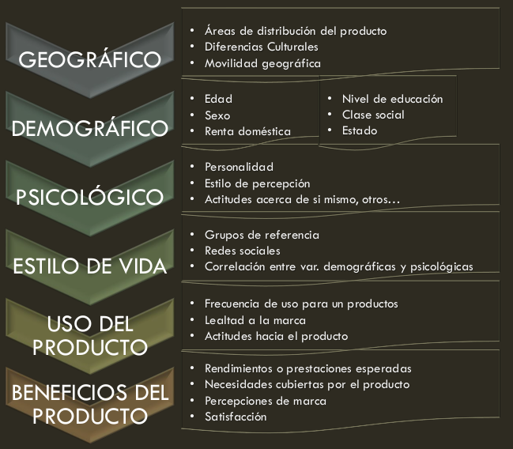

#### Disrupción Digital

* Movilidad y redes sociales
* Computación cuantica
* Internet of Thing
* Sistemas expertos
* Big Data
* Nube
* Block chain

> La tecnologia generar la disrupcción y la industria financiera sufre la distupcción
> La disrupción se manifiesta combinando dos o mas técnologias. 

##### Tecnologia Distruptiva: (Se usan en conjunto orquestandolas. )

* Mobile, Cuantica, IOT, Sistemas Expertos, BigData y nube. 
* Robotica, Protesis, Autos autonomos. Impresiones 3D, Carne sintetica, blockchain. 
* Lo que se viene: - Mellisos digitales, - Productos Customizados, Papel inteligente, nano medicina. 

> Revisar Congreso de Garner y el  impacto en el Negocio

* El talento en el Mundo: Faltan taletos para los nuevos trabajos del mundo. 
* Transformacion Digital con Personas, Tecnologia, y Procesos
* Estudio de We Are Social- Como avanza en el mundo con la tecnologia. 

> No hay que ver la tarea, si hay que ver el pantallaso total. No mirar a corto plazo. 

* Porque Cuestra la Transformacion? 
    - Incentivos a cortos plazos, 
    - Ignorancia, 
    - Silos, 
    - Gap de destresa digital.

#### Cultura organizacional

Cultura es el conjunto de normas de comportamiento y reglas no escritas que dan forma a un entorno organizacional y la forma en que los individuos interactúan a fin de desarrollar su tarea en ese momento. 

> La cultura es como un pez en el agua, está alrededor de nosotros pero es difícil de distingir. 

##### Componentes:

* Conocimiento: El 31% de las organizaciones informa que sus empleados son altamente consientes de cual es  la cultura de la organizacional deseada. 
* Actitud: El 13% de las organizaciones informa que los empleados muestran una fuerte creencia en la cultura organizacional deseada. 
* Comportamiento: El 10% de las organizaciones informaron que los empleados muestran un comportamiento fuertemente alieado con la cultura organizacional. 

#### Nuevos procesos:

* Design Thinking
* Lean Startup
* Agile
* User Experience
* Customer Journey Layers

#### Las 6D de una organización exponencial
Es una cadena de reacciones progresiones tecnologicas. 

* Digitalización
* Engañoso
* Disruptivo
* Demonetizar
* Dematerializar
* Democratizar

[6D](https://singularityhub.com/2016/11/22/the-6-ds-of-tech-disruption-a-guide-to-the-digital-economy/)

---

## 3. Martes 6/10: TIM y Estrategia de los oceanos azules. 

### **CIO**: Chief Information Officer
Principales cualidades:

1. Visión estrategica. Los sectores deben estar alieados y aplicar la técnologia.
2. Aplicar la tecnología alineada con el negocio.
3. Capacidad de liderazgo y motivación.
4. Conseguir mejor gente: Deben poseer habilidades duras y blandas.
5. Capacidad de innovación, creatividad.
6. Saber Negociar.
7. Capacitación.

### Tablero de control balanceado. Balance Scordcard(BSC). 

#### Imperativos Básicos: 
Tres objetivos que son independientes de la voluntad de quienes la dirigen. 

* Supervivencia
* Crecimiento
* Rentabilidad

_Estrategia_: Habilita de utilizar los recursos inteligentemente. 

#### Gestion Estrategica: 

Accionar. Es el arte de y la ciencia de *formular, desplegar, ejecutar, medir, mejorar permanente*. 

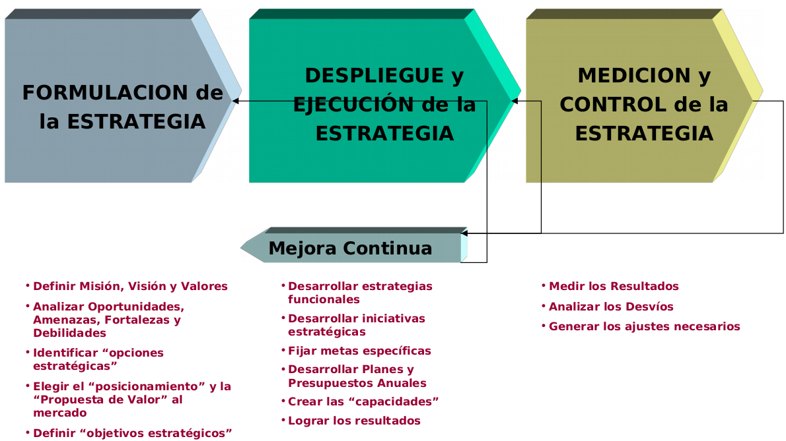

#### Elementos importantes a medir en un negocio:

1. **Satisfacción del cliente**. Si crece su cuota de mercado tambien crecera. 
2. **Satisfacción de los empleados**. Potenciara su productividad. su calidad, su orgullo y su creatividad. 
3. **Flujo de Caja**. Es el pulso, el signo vital de la salud de la compañia. 

#### Herramienta para la medición de performance organización. 

1. Financiera (Flujo de caja). Para satisfacer a los accionistas.
2. Clientes: Satisfacción del cliente
3. Interno: Mejorar los procesos internos 
4. Satisfacción de los empleados: Mas capacitaciones y crecimiento.

> Personal mas capacitado genera mejores procesos, impactando en una mejora en la satisfacción de los cliente, un cliente mas satisfecho trae mas ganancia. 

TP:

* Dos altarnativas por caracteristicas
* Indicar en las concluciones

#### El Balance Scordcard

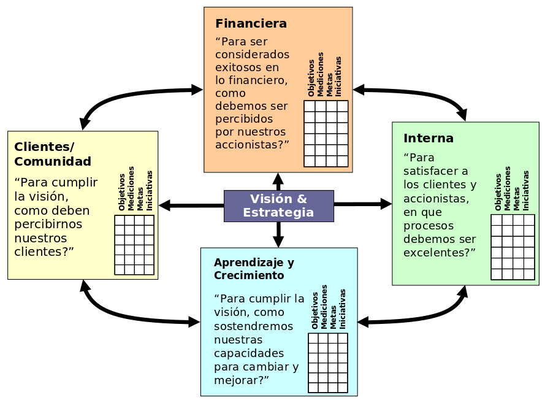

Ejemplo:

| PERPECTIVA | OBJETIVO ESTRATEGICO | METRICA | META      | INICIATIVAS                                            |
|------------|----------------------|---------|-----------|--------------------------------------------------------|
| **FINANCIERA** | Aumentar el ROI      | ROI     | 2017: 25% | Producto de mayor valor agregado para segmentos altos. |
| **CLIENTE**    | Incrementar fidelidad de los clientes | % de renovación de contratos| 2019: 96% | Programa de fidelización|
| **INTERNA**    | Disminuir tiempos de ciclo de entrega | Tiempo pedido-entrega | 2017: 40% | Reingenieria de proceso de distribución|
| **APRENDIZAJE Y CRECIMIENTO** | Mejorar la retención del personal clave | Índice de rotación de personal | Menor al 2% | Remuneración variable por obejetivos propuestos | 

### La estrategia del oceano Azul

Comó desarrollar un nuevo mercado donde la competencia no tiene ninguna importancia.

_¿Como pasamos al oceano azul? Realizar las siguientes acciones_:

* **Reducir**: ¿Cuantas variables se deben reducir muy por debajo de la norma de la industria?
* **Crear**: ¿Cuáles variables se deben crear porque la industria nunca las ha ofrecido?
* **Incrementar**: ¿Cuáles variables se deben incrementar muy por encima de la industria?
* **Eliminar**: ¿Cuáles variables de la industria da por centado que se deben eliminar?

Con estas cuatro acciones creaemos una **nueva curva de valor**.

_Preguntar para ver si es un oceano azul. _

* ¿Ofrece su idea una utilidad excepcional para el comprador?

Si es si. 

* ¿Es su precio accesible para el grueso de los compradores? Si se apunto a un taget de cliente especifico, no se hace la pregunta. 

Si es si. 

* ¿Podra lograr su meta de costos con rentabilidad, con precio estrategico?

Si es si. 

* Entonces estamos probablemente a un **Oceano Azul**

> Es importante analizar aquellos que no son clientes y tenerlos en cuenta como potenciales. 

## 4. Viernes Clase 9/10/2020 - Penta Modelo y 6P

Enfoque sistemico: Estudio de la organizacion genericamente.

### PENTA MODELO (Autor Alberto Levi)

Penta ha sido diseñado como herramienta técnica para diagnosticar e intervenir en las empresas, con el objetivo de apoyarlas en sus intentos de CVE

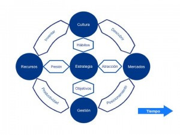

#### Pilares: 

* Cultura: Formas de trabajo o politicas de la organización. Tienen que ver en como se hacen las cosas. Usos y costumbres. Ejemplo: Los mail se guardan por 5 años. 
* Recurso: Todos los recursos.
    - Gente
    - Productivos
    - Financieros
    - Infraestructura
    - Marca
    - Mística
    - Crédito
    - Tiempo
    - Información
    - Conocimiento
    - Organicidad
    - Capacidad de Maniobra
    - Estabilidad
* Mercado: A donde apunta los productos. Que productos comprar, Que proveedores existen, como Negociar. 
    - Presión de Productos Sustitutos
    - Barreras de Ingreso
    - Barreras de Egreso
    - Poder de Negociación de Proveedores
* Gestion por Organización: Gestión intera. Relación entre sector. Tipo de supervicion.  **Revisar Autor Mintzberg**. 
    - Procesos operativos.
    - Sistema de información.
    - Estructura organizacional.
* Estrategia:
    - Creación de Valor Económico
    - Misión
    - Estrategia de Portafolio
    - Estrategia Competitiva de cada Negocio
    - Empuje Estratégico

> Todos los pilares deben estar alineados con la Estrategia. 

Referencia: [Video](https://www.youtube.com/watch?v=ICy36XQ8E6c)

#### Tarea: 

1. Conocer la herramienta.
2. Aplicar la herramienta relevando.
3. Analizar la herramienta y verifica que pasa con cada uno de los puntos. ¿Para que sirve la herramienta?

### 6P (Mercadotecnia)

Autores: Kotler y Druker en el area de mercadotecnia. 
* Kotler: La mercadotecnia es una actividad humana cuya finalidad consiste en satisfacer las necesidades y deseos del ser humano mediante procesos de intercambio. 
* Druker: La finalidad es conocer al consumidor. 

#### Tipos de mercados
* Analizar el mercado, ver lo que necesita y visualizar el norte. 
    - Monopolio: Baja cantidad de empresas, Alta diferenciación de productos.
    - Oligopolio: Baja cantidad de empresas, Baja diferenciación de productos.
    - Competencia Imperfecta: Alta cantidad de empresas, Alta diferenciación de productos.
    - Competencia Perfecta: Alta cantidad de empresas, Baja diferenciación de productos.

> Ayuda a ver a que mercado el producto esta orientado.

* Caracteristicas de las empresas:
    - Lideres: mayor participación relativa.
    - Retadoras: Se expanden agresivamente.
    - Seguidores: Mantienen participación.
    - Encajonadas: Atienden pequeños sectores.
    - Invasoras: Atacan con productos sustitutos.

* Comercialización:
    - Tipos:
        - Pasiva
        - Productiva
        - Estrategica
        - Social
    - **Vendemos experiencia**

#### Las 6P
- **Producto**: Bien tangible o intangible. Para un segmento determinado del mercado.
    - Atributos: Basico, Real,....
    - Caracteristicas: Se pueden analizar algunos productos
        - Producto Ideal: Zona 4 (Oportunidad)
        - Producto Real Propio.
        - Producto Real Competencia.
        
    - Relacionado con **Boston Consulting Group y Matriz de Pareto** y se utilizan para poder elegir los productos mas importantes a analizar con el diagrama de caracteristicas.
    - Ciclo de vida: Para ver en que etapa esta un producto, utilizar **Boston Consulting Group**
        - Embrionario
        - Crecimiento
        - Madurez: Tiene un punto de camio tecnologico.
        - Envejecimiento
- **Paquete**: Se analizá el empaquetado del producto, la marca. Se analizan la conveniencia del uso de marca. Buenas practicas para el nombre de Marca.
- **Precio**: Relacionado al segmento que aplica el producto seleccionado.
    - Se revisa el percio de marcado.
    - Depende del objetivo.
    - Es parte del producto.
- **Plaza(o mercado)**: Lugar donde se realiza la oferta y la demanda. Darle importancia a la _DISTRIBUCIÓN_. Ejemplo: Canales de industria financiera. **Realizar Investigación de Mercado**. 
    - El mercado esta _segmentado_. Se utilizan variables duras o blandas.
        - Variables DURAS: Edad, Sexo, Nacionalidad, Educación
        - Variables BLANDAS: Estilo de vida, prejuicios, estilo de mujer activa.
    > _La segmentación es válida si el beneficio que obtengo por segmentar es mayor que el que obtendría si no lo hiciera_
    - Estrategias de cobertura de mercado:
        - Mercadotecnia **indiferenciada**: Mercado total y segmentos relevantes.
        - Mercadotecnia **diferenciada**: Oferta especifica por segmento.
        - Mercadotecnia **concentrada**: Porción del mercado o varios sumercados.
    - Posicionamiento: Lugar que ocupa un producto en la mente de un consumidor.
    - Herramienta **MATRIZ DE ANSOFF**
        
- **Publicidad**: Avisos según tamaño y costos; Pauta; Pieza publicitaria; Aviso.
    - Aumentar participación en el mercado.
    - Informar lanzamiento de nuevos productos.
    - Reposicionar productos.
    - Fijar la imagen de una empresa o producto.
    - Aumentar barreras de entrada a un mercado.
- **Promoción**:
    - Dar a conocer el producto. 
    - Inteligencia de negecio: "Solo existen dos fuentes genuinas de venta competitiva"
        1. La habilidad para conocer mas de nuestros clientes que la competencia
        2. La habilidad para transformar ese conocimiento en acciones antes que la competencia.
    - Gestión de clientes, para poner **FOCO EN EL CLIENTE**. Para SATISFACER CLIENTES:
        - Adquirir clientes
        - Vincular clientes
        - Retener clientes

## 5. Martes 13/10/2020 - Teoria de la organización

### Configuraciones estructurales

1. Estructura simple.
    - Coordinación: Supervisión directa.
    - Parte fundamental: Ápice estratégico.
    - Parametro de diseño: Centralización.
    - Factores de contingencia:????
    - Problemas: 
        - La decisión la toma una sola persona.
        - Tiende a confundise lo operativo con lo estratégico.

2. Burocracia Maquinal.
    - Coordinación: Normalización de procesos.
    - Parte fundamental: Tecno estructura.
    - Parametro de diseño: 
        - Formalización del comportamiento.
        - Especialización vertical.
        - Desentralización horizontal limitada.
        - Planificación de acciones.
        - Agrupaciones funcionales generales.
    - Factores de contingencia:????

        

3. Burocracia profesional.
    - Coordinación: Normalización de habilidades.
    - Parte fundamental: Núcleo de operaciones.
    - Parametro de diseño: 
        - Preparación
        - Especialización horizontal del puesto.
        - Descentralización vertical y horizontal.
    - Factores de contingencia:????

4. Forma divisional.
    - Coordinación: Normalización de salidas(outputs).
    - Parte fundamental: Linea media.
    - Parametro de diseño:
        - Agrupación a base de mercado.
        - Sistema de control de rendimiento.
        - Descentralización vertical limitada
    - Factores de contingencia:????
    - La CEDE CENTRAL tiende a centralizar decisiones, cuando la mejor información la tienen las divisiones.
    - Las DIVISIONES se suelen enfocar en sus objetivos económicos y fallan en lo social (ambiente laboral, calidad de producto, protección ambiental, etc).

5. Adhocracia: Se forma a "ese efecto".
    - Coordinación: Adaptación mutua.
    - Parte fundamental: 
        - Nucleo operativo (Adhocracia Operativa). Consultora, Estudio de desarrollo urbano.
        - Staff de apoyo(Adhocracia administrativa). Estudio de arquitectos.
    - Parametro de diseño:
        - Agrupa especialistas en unidades funcionales.
        - Desentralización selectiva vertical y horizontal.
    - Problemas:
        - Relaciones humanas: Puesto no claramente definido.
        - Eficiencia: No es eficiente para acciones ordinarias. Irregular carga de trabajo.
        - +DEMOCRACIA Y - BUROCRACIA => Pierde capacidad de INNOVAR.
    - Ejemplo: Una obra. Cada parte participa y se forma para un fin especifico.

    

| Configuración Estructural  | Principal Mec coordinación           | Parte Fundamental     | Tipo de descentralización    |
|----------------------------|--------------------------------------|-----------------------|------------------------------|
| **Estructura simple**      | Supervisión directa                  | Ápice Estratégico     | Centralización V - H         |
| **Burocracia Maquinal**    | Normalización de procesos de trabajo | Tecnoestructura       | Descentralización H Limitada |
| **Burocracia Profesional** | Normalización de habilidades         | Núcleo de Operaciones | Descentralización V y H      |
| **Forma Divisional**       | Normalización Outputs                | Línea Media           | Descentralización V Limitada |
| **Adhocracia**             | Adaptación Mutua                     | Staff de Apoyo        | Descentralización Selectiva  |

Revisar en la organización, que configuración tiene. 

### Roles gerenciales:

* Interpersonal
    - Figura Central
    - Lider
    - Vinculo
* Información
    - Monitor: Supervición de la información.
    - Diseminador: Determinan a quien le envia la información. (Clearance). Que información se va a difundir.
    - Vocero: Dice por si mismos las cosas importantes
* De Decisión:
    - Emprendedor
    - Gestor de disturbios: Gestión del poder. Disturbios hacia adentro o hacia afuera por temas de información, presupuesto o personales. Deben evitar los disturbios dentro de la organización.
    - Asignador de recursos: Fisicos, financieros, información, y de recursos humanos.
    - Negociador: Relacionado con gestor de disturbios.

### Habilidades gerenciales:

* Técnicas: Sabes lo que hay que hacer. 
* Interpersonales: Interactuar con todos. Con enfoque cooperativo. NO significa ser amistoso. 
* Conceptuales: Entender de que se trata la actividad. 
* Diagnostico: Entender lo que esta pasando. 
* Comunicación. 
* Toma de decisiones. 
* Administración del tiempo. 

### Control y supervición:

* Control
    - Ejecuta
    - Responde a un programa

* Supervisor
    - Ejecuta el apice Estrategico
    - Responde al conocimiento profesional, propio interes, experiencia, responsabilidad.
    - Lleva implicita la decisión

### Administración de Proyectos:

1. Analisís de factibilidad: 
2. Analisís de aceptabilidad: Con respecto al Costo. 
3. Factibilidad: Posibilidad de realizarse con los recursos disponibles. 
4. Viabilidad: Posibilidad de que el entorno nos permita realizar la tarea. 

Caracteristicas:

* Especificidad
* Singularidad
* Transferencia

## 6. Viernes 16/10/20: ESTRATEGIA DELIBERADA

### Estrategia

> _"La estrategia competitiva consiste en ser diferente. Significa la selección deliberada de un conjunto de actividades, para entregar una mezcla unica de valor. "_ **Michel Proter**

> _"Las empresas deben redefinir sus estrategias para no solo generar riqueza a sus accionistas, sino tambien a la sociedad como un todo. "_ **Michel Proter**

### Estrategia Deliberada

#### Componentes:

* Misión, Visión y Valores
    - _Misión_: Forma en que la empresa quiere ser reconocida. Es un lema. ¿Que hacemos?¿Cual es tu negocio?
    - _Visión_: Define las metas que pretendemos conseguir en el futuro. Debe ser realista y alcanzable. Caracter inspirador y motivacional. 
        - ¿Que quiero lograr?
        - ¿Donde quiero estar en el futuro?
        - ¿Para quien lo haré?
    - _Valores_: Principios éticos y cultura de la empresa. No mas de 6 o 7 valores. ¿Como somos? ¿En que creemos?. Deben ser descriptivos y claros

* Objetivos, Metas, Cuadro Integral de Mando (PENDIENTE)

    En base a la misión, visión y valores, se definen los objetivos y las metas. 

* Planificación de escenarios: Permite definir los **escenarios mas probables** analizando las variables mas relevantes de la industria. 

    

- **Fiebre de oro**: Fragmentada y Demanda Creciente, Ejemplo: Parripollos, Canchas de futbal. Hay muchos oferentes y mucha demanda. 
- **Paraiso perdido**:  La unica forma es sacarle los clientes a un competidos debido a que hay menos demanda. La demanda empieza a consolidarse.
- **Guerra de desgaste**: Consolidada y Baja Demanda, Empieza a ver muy poco demanda, las empresas van comprando otras empresas para obtener los clientes a los otros.
- **Jaula dorada**:  Pocos oferentes pero esta regulada, por ejemplo los monopolios.

* Análisis de las Fuerzas competitivas
    - Competencias Claves: 
        - Permite que la alta gerencia enfoque sus esfuerzos en desarrollar ventajas competitivas.
        - Permite _Conectar_ las estrategias de negocio con las competencias individuales y colectivas.
        - Competencias fundacionales y estrategicas.
    - Analisis de fuerzas competitivas 
        - Proveedores: Son mucho o no, tienen fortaleza en sus productos.
        - Competidores: ????????
        - Nuevos y sustitutos: Productos que reemplaza al propio producto.
        - Barrera de entrada: Son regulaciones o son las inversiones necesarias para el negocio.
        - Barrera de salida: ???????

    - Posicionamiento y segmentación
        - Posicionamiento: Tener un pedazo de la cabeza de tu cliente. Cuando el cliente pienza en un producto o servicio, lo primero que le llega a la mente es la marca.
        - Segmentación: No es separar a la gente. Es agrupar y reconocer los segmentos.

* Estrategias:
    - **Estrategia de liderazgo**: 
        - en costo, 
        - en ser el mejor, acompañado del precio ó 
        - en ser el unico, que hace determinada cosa.
    - **Estrategia de Retador**:
        - Pelear el lugar al Lider.
    - **Estrategia de Seguidor**
        - Copia al lider. Clon, imitador o adaptador.
    - **Estrategia de Nichos**
        - Atiende a un tipo de usuario.
        - Atender a una etapa en la cadena de producción.
        - Personalizar el producto para un tipo de producto.
        - Operar en un determinado segmento del mercado.
        - Hago un producto para un canal de venta.

* Cadena de Valor: (Mikel porter - Libro: Ventaja competitiva)
    - Exiten criterios de evaluación
        - Criterios de satisfacción
        - Costo tecnologico sobre el costo total de la información.
    - En los puntos donde hay incertidumbre o no hay información se deben hacer inferencias.
    - Cadena de valor ampliada:
        - La cadena de valor de empresa, se ve afectada por la cadena de valor de proveedores y compradores.
        - Ejeplo de Bancos.

* Perfil de respuesta del Competidor
    - Si bajo el precio de mi producto, como afecta a mis competidores.

* Autoanálisis
    - Analisis de desempeño.
    - Analisis de diferencias.
    - Estrategias pasadas y futuras.
    - Analisis de organización interna.
    - Analisis de costos.
    - Recursos financieros.
    - Matriz de BCG: **Analisis de portafolios de productos**: Participación en el mercado vs el Cecimiento.
        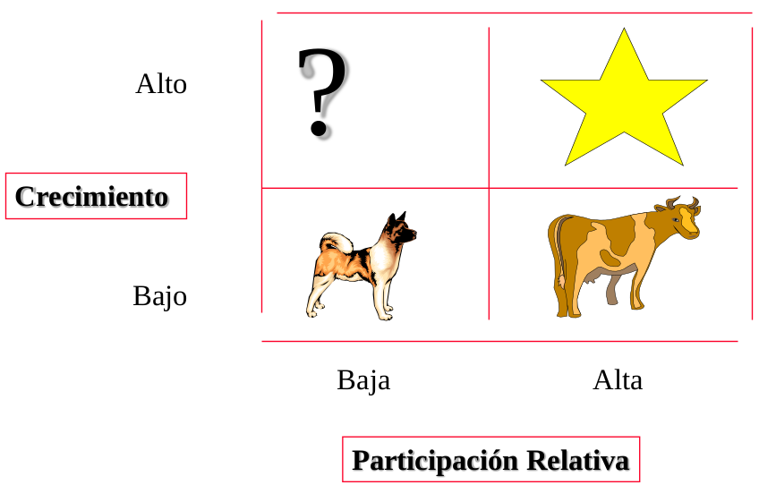
        - Productos VACA: Productos que generan ganancias Netas. El mercado no crece pero se mantiene.
        - Productos PERRO: Productos con poca participacion y bajo crecimiento
        - Productos Estrellas: No producen rentabilidad porque siguen pagando el costo del producto. Son las vacas del mañana.
        - Productos Incognita: 

        Referencia: [Boston Consulting Group](https://ingenioempresa.com/matriz-bcg/)
    
    - Matriz de Ansoff
        - Penetración de mercado
        - Desarrollo de mercado
        - Desarrollo de producto
        - Diversificación de mercados
        

* FODA: 
    - Foralezas(internas): Ventajas competitivas
    - Oportunidades(externo): Contexto donde la empresa no tiene control. 
    - Debilidades(internas): 
    - Amenazas(Externas): Contexto donde la empresa no tiene control. Tipo de cambio.
* Análisis CAME: 
    - Foralezas: -> Mantener
    - Oportunidades: -> Explotar
    - Debilidades: -> Corregir
    - Amenazas: -> Afrontar

## 7. Martes 20/10/20: Cadena de Valor Agregado

### Cadena de Valor Agregado

* Valor Agregado: Todo aquello que le podemos agregar a un producto o servicio. 
* ¿Se puedo ofrecer algo mejor?
    - Menor costo
    - Mejor producto o servicio segun la persona.
    - Algo especial para él.
* Cadena de valor: Tanto dentro de la empresa como fuera de la empresa, hay cadenas. 
* _Cuello de botella_:
    - Es el _recurso con menor capacidad_ en el proceso. Cuando se habla de recursos se tiene en cuenta el tiempo, mano de obra, productos intermedios, etc.

    > La restricción es la capacidad de toda la planta.

    - Tiene altos inventarios para procesar
    - Las etapas posteriores del proceso tienen _tiempo de espera_.
    - Ejemplo: La etapa 3 dicta la capacidad maxima de todo el proceso.
        - Etapa1:95 piezas
        - Etapa2:110 piezas
        - Etapa3:85 piezas
        - Etapa4:90 piezas
    - Se producen tiempos ociosos.
* Solo existe una sola restricción que impide que la empresa gane dinero.
* Es eslabon mas debil, determina la fortaleza de la cadena. 
* Es una herramienta de comparación. Se compara la empresa con la misma empresa en otro momento o con otros competidores. 

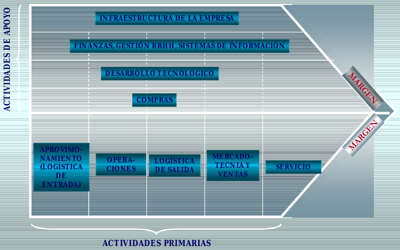

### Eficiencia en Costos 
Para ser eficientes se debe tener los 4 ejes rectores alineados.

1. **Experiencia(Expertice)**: Curva de aprendizaje.
2. **Diseño de productos/servicios**: Un mal producto/servicio va en contra de tener eficiencia en costo.
3. **Costo de abastecimiento**: Dale importancia a los costos de materia prima y tener una relación óptima con los proveedores.
4. **Economia de escala**: Producción en masa (enlatado) puede traer ventajas en costos. Recupera la inversión del capital a través de volumen alto.

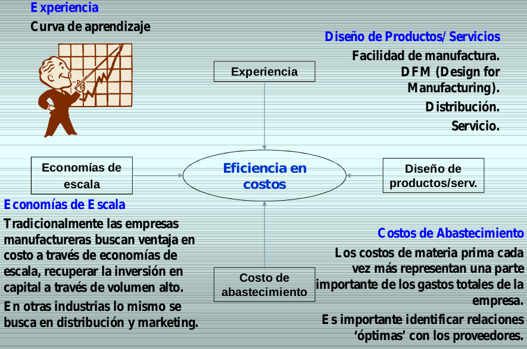

### Interrupción crítica de cadenas de suministro complejas:

Construyecto Transparencia y resiliencia: Ninguna empresa opera de manera aislada. Es escencial identificar los riesgos de continuidad de negocio. Desarrollar 3 pasos:

1. Prevensión: 
    - Hablar con proveedores criticos para contemplar sus planes.
    - Identificar proveedores alternativos
    - Revisar responsabilidad contractual en caso de demora.
2. Respuesta:
    - Almacenar suministros criticos.
    - Continua comunicación con proveedores.
    - Adaptar los pedidos y arreglos de envios para la distribución.
3. Recuperarse:
    - Encontrar nuevos proveedores.
    - Revisar lecciónes aprendidas con proveedores criticos.
    - Explorar clausulas contracturales.
    - Revisar los KPI del contrato.

La organización será capaz:

- Que pueda cambiar de proveedor con poca anticipación.
- Tener visibilidad en tiempo real en cada etapa sobre el desarrollo de puntos criticos.
- Implementar otras medidas de gestión de riesgos para garantizar que su negocio siga siendo resilientes.

> Objetivo: Mayor valor con menor costos.

**TIPS**:
> Estudiar la audiencia y la horatoria para las presentaciones. 

----

## 8. Viernes 30/10 - Estrategia Emergente

* Todo lo que se digitaliza, baja sustancialmente los costos.
* Comparación: 
    - Estrategia deliberada: Estrategia formulada en forma racional, de arriba abajo siguiendo la secuencia 
        1. Formulación
        2. Implementación.
        3. Control.
    - Estrategia emergente: Estrategia observada en la practica y que no tiene que ser formulada de forma racional ni ser secuencial. 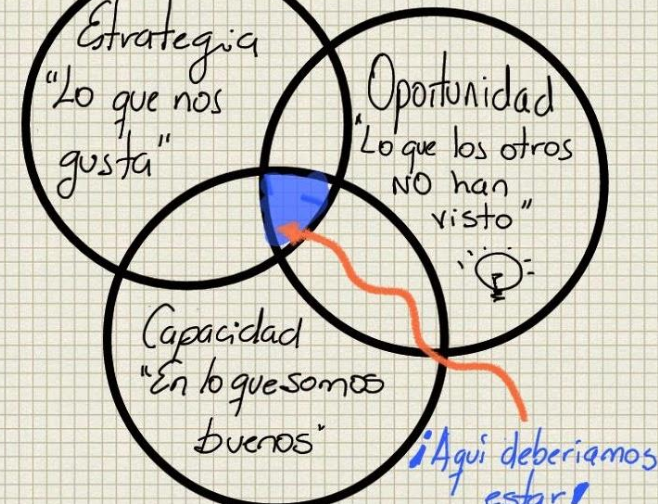
### LEAN
* Filosofia:
    - Eliminar los residuos
    - Enfoque en la mejora continua.
    - Centrado en el cliente.
    - Eliminar cualquier actividad que no agregue valor.
* Lean Manufacturing:
    1. Suprimir desperdicios
    2. Trabajar en zero defectos.
    3. Implicar al personal.
    4. Adaptarse al cliente.
    5. Optimizar los recursos.
    6. Pensar en "on time delivery".
    7. Utilizar KPIs útiles.
* Lean Start Up:
    - Experimenta sobre hipótesis(mide progreso).
    - Lanza productos e itera.
    - Aprendizaje validado.

    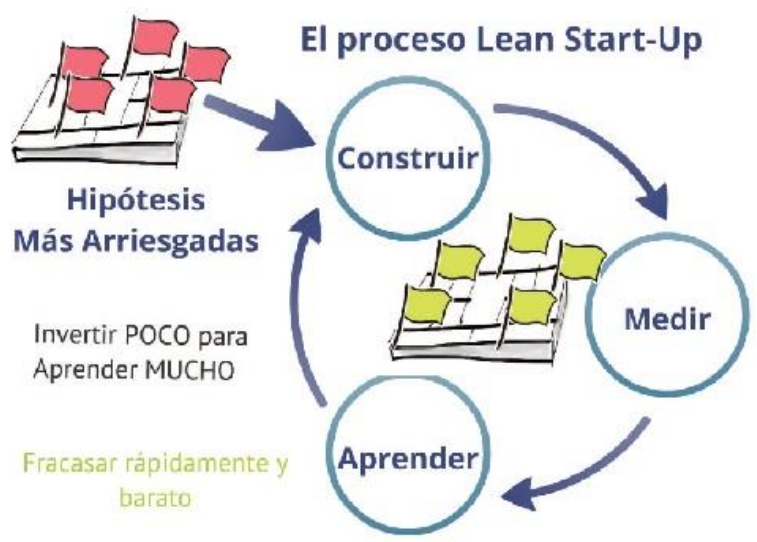

* Diferencias en entre producto y servicio:

    Producto                                    | Servicio
    --------------------------------------------|----------
    Producido                                   | Brindado.
    Material                                    | Inmaterial.
    Tangible                                    | Intangible.
    Puede almacenarse                           | No puede almacenarse.
    Aislado del cliente                         | Interacción con el cliente.
    Se consume luego de producirse              | Se consume al mismo tiempo que se produce.
    Pueden presentar defectos de la fabricación | Pueden observarse errores en el comportamiento.

    - El cliente es el que paga. El usuario es el que usa el servicio/producto.

### Modelo Blank:

1. Descubrir al cliente: ¿Le interesa a alguien?
    - Conocer la reacciones y devoluciones de los cliente para validar hipotesis planteadas.
    - Realizar entrevistas e investigación-
    - Termina cuando encuentro un producto para un grupo de clientes.
    - Valido que al cliente le sirva el producto.
    - Todo esto se llama "Ensamble Problema solución" + MVP1.0 + Evolución. 
2. Refrendar(confirmar o validar) al cliente: ¿Cuantos clientes y si van a pagar?
    - Vender el producto 
    - Ensamble Producto Mercado: ¿?Hay un mercado que me permita tener un volumen? ¿O es limitado?
    - Se consiguen muchos cliente que pagan por el prototipo.
    - Ensamble Producto Mercado + Modelo de Negocio (como se vende, entrega, cobrar) + Mapa de ruta comercial.
    - MVP: Minimo producto que se pueda usar.
3. Creación del cliente:  
    - Se consiguen muchos cliente que pagan por el PRODUCTO.
    - Crear al mercado de masas.
    - Definición de ruta de marketing.
    - Negocio escalable.
4. Construcción de la empresa: 
    - Se construye la empresa.
    - Creación de estructura y procesos que soportan el escalonado.
    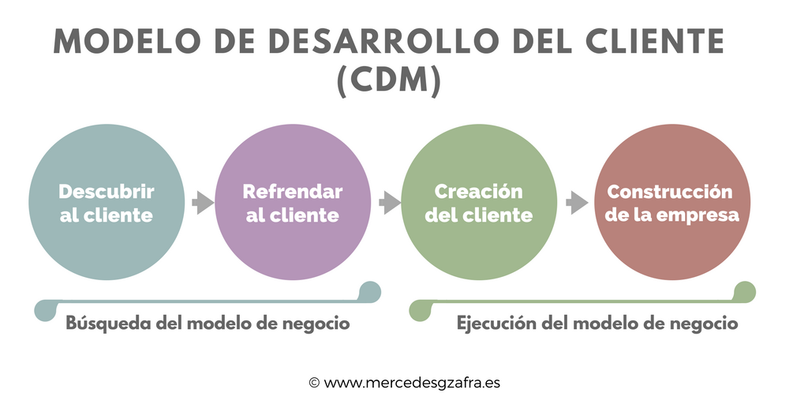

### Piramide de Ries:
- Producto: Entrega del valor. 
- Estrategia: Creación del valor. 
- Valor: Captura el valor.

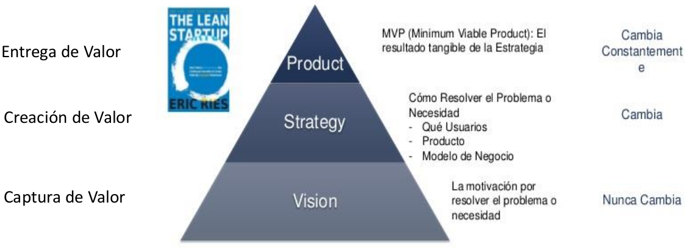

### Método Lean Canvas

#### Propuesta de valor: 

Para transcribir en el canvas. Diferentes propuesta de valor para cada segmento. 

> La propuesta de valor no es el producto o servicio, sino el valor que entregamos a partir de él.

* Condiciones:
    - Relevante
    - Diferente
    - Creible

#### Esquema de propuesta de valor: 

- Trabajo de los clientes o las necesidades.
    - Funcionales, Sociales, Emocionales, Necesidades basicas.
- Puntos de dolor para el cliente. Cual es su preocupación.
    - Riesgos, costos, Sentimientos negativos, dificultades.
- Ganancia esperadas o adicionales para el cliente.
    - Satisfacción
    - Expectativas de servicio y costo.
    - ¿Qué les mejora la vida?
    - ¿Qué les emociona?
    - Beneficio, Precio, Opiniones, Comunidad, Servicio
- Producto y Servicio: 
    - Listar de productos.
    - Market place
- Mitigadores de dolores: Garantias, valoraciones
    - Garantias, Valoraciones y perfiles, Ubicaciones y fotos
- Creadores de ganancias: 
    - Politica de incentivos, Ofrecer mejor opción, Masividad.

> Todo esto se transcribe en el Lean Canvas.

> Si hay dos segmento de cliente, realizar dos esquemas de valor, uno por cada semento.

## 9. Viernes 30/10/20 - Clima Laboral

**Recursos**: Es un insumo producto o activo competitivo que la empresa controla y poseé. 
- _Tangibles_: 
    - Recursos fisicos
    - Recursos financieros
    - Activos Técnologicos.
    - Recursos organizacionales.
- _Intangibles_: 
    - Activos humanos y capital intelectual
    - Marca, imagen de la empresa y activos de la reputación.
    - Relaciones: Alianzas y sociedades.
    - Cultura y sistema de incentivos de la empresa: Normas de conducta, sist. de compensaciones, grado de motivación del personal.

**Capacidad**: Es la habilidad de una empresa de desempeñar alguna actividad de manera muy eficiente. 

Referencia: _A. Thompson, M. Peteraf, J. Gamble, A. Strickland. Administración estratégica. Teoría y casos.  2012.18ma ed. pp. 95_

**Capacidad organizacional**: Son entidades más complejas que los recursos; en realidad, se forman a partir del uso de los recusos y aprovechan cierta combinación de los recursos de la empresa conforme se usan. Se basan en _conocimientos que residen en la gente y en el capital intelectual o en los procesos y sistemas organizacionales de la empresa, los cuales incorporan conocimiento tácito._ Ejemplos:
1. El manejo de la marca General Mill, con el conocimiento de los administradores de marca de la empresa, la experiencia del departamenteo de marketing y la relación con los distribuidores.
2. La capacidad de diseño de los videos juegos de Electronic Art, deriva de la creatividad y pericia tecnológica de sus muy talentosos desarrolladores.

Referencia: _A. Thompson, M. Peteraf, J. Gamble, A. Strickland. Administración estratégica. Teoría y casos.  2012.18ma ed. pp. 96._

**Capacidad dinamica**: Es la habilidad de modificar o aumentar los recursos y capacidades existentes. Trabaja los recursos y las personas.

### Recursos Humanos (RRHH)

_Reclutamiento_: Proceso de atraer personas calificadas para solicitar puestos que estan vacantes.

_Proceso de Selección_: La intención del proceso de selección es recabar información de los solicitantes
- Validación.
    - Validación Predictiva.
    - Validación del contenido.
- Solicitud en blanco.
- Pruebas.
- Entrevistas.

_Evaluación de desempeño_: Evaluación formal de que tan bien los empleados hacen su trabajo.

_Grupos_
- Grupo Funcional
- Grupo informal
- Grupo de tarea

_Modelo de Tuckman_
1. Formación
2. Enfrentamiento/conflicto
3. Normalización
4. Desempeño
5. Finalización/Disolución

## 10. Martes 03/11/20 - Motivación, Toma de decisión, Negociación.

### 10.1 Motivación

#### Teoria Clasicas 

- **Motivación Maslow**: Piramide Jerarquía de necesidades.

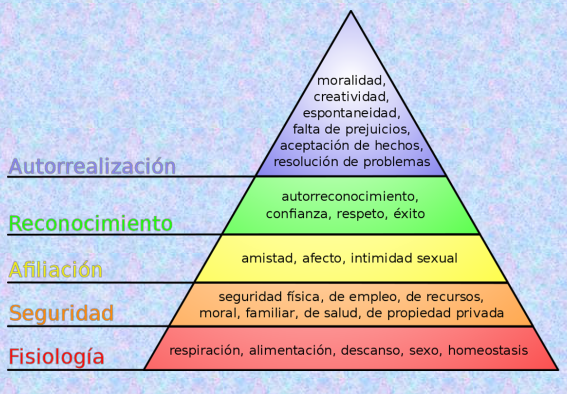

- **Motivación Herzberg**:
    - Satisfaccion puede no estar alineado a las expectativas
    - Las personas estan influenciadas por dos factores.
        - La satisfacción: Es el principal resultado de los factores de motivación.
        - La insatisfacción: Es principalmente el resultado de los factores de higiene.

- **Motivación Mc Clain**
    - Poder: Tener las competencias para hacer algo.
    - Afilicación: Formar parte de una organización para aplicar esa competencia.
    - Logro: Poder Lograrlo.

- **Motivación Mc Gregor**:
Factores X y Factores Y: Pueden relacionar con mecanismos de coordinación.
    - Factores X: 
        - Ser humano rechaza el trabajo.
        - Se van a asociar con Supervisión directa y normalización de Procesos
    - Factores Y: 
        - El ser humano ve el descanso como el trabajo.
        - Se van a asociar con Adaptación Mutua, Normalización de resultados.

### Teorías Contemporaneas

- **Teoría de Existencia**, Relación y Crecimiento (ERC).

- **Teoria de la expectativa**: Depende de dos coas; _cuanto queremos algo_ y que _probabilidad creemos tener de obtenerlos_.
1. Combinación de fuerzas en el _individuo_ y en el cambio de _entorno_.
2. Las personas toman _decisiones_ acerca de su comportamiento en las organizaciones.
3. 
4. 

- **Teoria de la equidad**: Las personas estan motivas a buscar una _equidad social_ en las recompensas que reciben por el desempeño.

- **Teoría del establecimiento de metas**: El comportamiento es el resultado de las metas. 

> Obstaculos, los que usted percibe cuando pierde de vista el objetivo.

### 10.2 Toma de decisión

#### Etapas (Herbert Simon)

1. Inteligencia: 
2. Diseño: Diseñar curso de acción.
3. Elección: Elegir entre distintos cursos de acción.
4. Revisión: Evaluar las acciones pasadas.

#### Etapas (Henrry Minztberg)

1. Identificaciones
    - Diagnostico   
2. Desarrollar soluciones
    - Busqueda
    - Diseño
3. Selección
    - Estudio: Estudiar las soluciones disponibles.
    - Evaluación - Elección
    - Autorización

> Proceso de desiciones Adhoc, ver libro

#### Racionalidad limitada

Atributos:

- El individuo esta limitado por sus habilidades mentales, hábitos y reflejos. Nos limita en nuestra racionalidad en decidir algo.

- La extensión del conocimiento y la información que posee. Por ejemplo sabemos mucho pero tenemos poca información ó sabes poco y tenemos mucha información. La información nos lleva a tomar decisiones bajo certeza, riesgos o incertidumbre.

- Valores o concepto de proposito que pueden discreptar de los objetivos de la organización. _Las personas tienen una incruencia entres los valores personales y las de la organización_.

#### Cursos de acción

Para un curso de acción se deben definir:

- Apto
- Factibilidad
- Viabilidad
- Aceptabilidad

### 10.3 Negociación

Es una estrategia de comunicación.

Necesidad de interactuar con alquien

Actitu de receptividad y de maxima tolerancia.

- _Necesidad_: 
- _Deseo_: 
- _Objetivo_: (No detecten el objetivo)
- _Interés_: Bien que un actor posee, protege, mantiene. (Lo oculto)

#### Tipos de negociación

- Cooperativa: Distinto de amistoso
- Adversarial: Ganar - Perder

#### Variables de la negociación

- Poder: Imponer la voluntad a otro.
- Información: Tener conocimento, adquierir conocimiento y tomar deciciones.
- Tiempo: administar el tiempo en función del espacio sin llegar a obligar llegar a un acuerdo.
- Espacio: Donde se desarrolla la negociación

#### Metodo de los principios - Método de Harvard

- Separar a las personas del problema(no enojarse con las personas).
    - Personas - Actores
    - Actúan y llevan a situaciones críticas.
- Concentrarse en el interés y no en las posiciones(objetivo, ¿para que lo quiere?, ¿que tiene que satisfacer?)
    - Objetivo SMART
        - Especifico
        - Medible
        - Alcanzable
        - Realista
        - Tiempo limita.
    - Interés esta velado
    - Posición. 
- Inventar opciones de _mutuo beneficio_(Se necesita saber lo que el otro quiere).
    - Tiene que haber dialogo. Uno no puede salir mal de la negociación.
    - Ayuda al acuerdo.
    - ZOPA: Zona de posible acuerdo.
        - Lo Máximo que puede dar.
        - Lo Minimo que puedo pedir.
- Insistir que los criterios sean objetivos
    - Precio
    - Ley. Directivas. Normas.
    - Tiempo.
    - Factores de gestión. Cosas que llevan tiempo.

#### Crisis

El problema es un desvio de la realidad y debemos lograr volver a la realidad. 

- Si el problema no tiene solución, entonces estamos en una realidad. Es un hecho que no se van a cumplir. Y aparecen nuevos actores.

> La crisis es: Imprevisible, Inexplicable e imprevisible.

- En el conflicto la variable estrategica es el poder. 

- El vencedor del conflicto define la nueva realidad. La negociación comienza cuando se encuentra en la etapa de conflicto.

> El ejecutivo Racional (Libro)
> Teoria del conflicto (Remo Entelman)

## 11. Viernes 06/11/20 - Simulación de negociación

### Modelo Cynefin
    - Complicado
    - Complejo
    - Caótico
    - Claro

### MAAN
- Mejor Alternativa de Acuerdo Negociado.
- No es piso ni techo.

### Aspectos a tener en cuenta
- Grado de liberta de la decisión para llegar a acuerdo y capacidad de firmar compromiso.
- 
- Libertad de acción: Obrar según la propia intención.
- El acuerdo se puede diferir y comprometer al ápice estratégico. Despues de tener todas las alternativas, negocian los apicé estrategico.
- Confundir la prudencia con la cobardia. 
    - Parar
    - Pensar
 

- ver problema
- Curso de accion
- Elegir alternativas

- Simulación
    Vocero Jorge de Comercializacion
    - El  

- Operaciones
    - Una hora.
    - Cuatro horas.
    - Ultima hora.
    - No se entrega en el dia.

## 12. Martes 10/11/20 - Cadena de valor y Simulación

### Vinculos en la cadena de valor

- La previsión de problemas internos evita demostraciones hacia el exterior de la empresa.

> Posible solución: Integrar los sectores de operaciones o de comercialización.

### Roles gerenciales en Practica

- Resolución de conflicto
- Monitor

Dirección: https://meet.google.com/znz-eqie-kzm 
La Plata: https://meet.google.com/qbr-awpj-ynx 

## 12. - Innovación

### Modelo CYNEFFIN
- Claro/simple: Existe la mejor practica.Es un dominio controlado.
    - Manuales
    - procesos sistematizados y procedimientos.
    - Recetas para cada situación.
    - Tareas de los decisores:
        - Percibir
        - Catalogar
        - Responder
- Complicado: Es el mundo de los especialistas. Es un dominio controlado. BAU.
    - 
- Complejo: Cuesta determinar lo que va a pasar en el futuro.
    - Etapa de experimentación.
    - No se pueden percibir los resultados.
    - No hay recomendación de expertos.
    - Decisores:
        - probaar
        - percibir
        -
- Caotico: se debe estabilidar la situación.
    - Es dificil encontrar patrones.
    - No hay expertos.
    - No hay practicas.
    - Decisor:
        - Actua
        - Dar sentido
        - Responde.
    - Es un ambito de innovación.

- Estabilizar la situación con patrones y ordenar. Ambito caotico.
- Probar y experimentar en una situacion compleja. Evaluar las variables. Ambito complejo. 
- Llamar a un experto para soluciar un problema. Ambito de complicado(expertos).
- Armar una procedimiento. Ambito simple (Busines as usual).

#### Diversidad:

#### Generar Ventajas competitivas

#### Empresas innovadoras: Tienen diversidad.

#### Creatividad:
    - Dedicar tiempo a pensar en el problema.
    - Se puede potenciar, entrenar y desarrollar.
    -Buscar información
    - Perder miedo a equivocarse.
    - Las ideas nacen vulnerables y trabajar en fortalecerlas.
    - Capacidad de presentarla.

#### Pensamiento de grupo
    - Bajo la presión se anula la diversidad en el grupo. (presión de grupo). Antenta contra la diversidad y la innovación.
    
     

## Clase Martes 17/11 : Comunicación

### Teorá de las comunicaciones

- Telefono descompuesto.

### Ventana de Johari
Entender la comunicaciones de una persona respecto a su entorno.

Proceso de dar y recibir feedback.

Ejercicios:
-
-

|      | Información conocida por uno mismo | Información desconocida por uno mismo |
|------------------------------------|-------|-------|
| Información conocida por los demas | Abierto (1) | Ciego (2) |
| Información desconocida por los demas | Oculto (3) | Desconocido (4) |

La ventana de interacción en un nuevo grupo difiere de una ventana de interacción esperada con aprendisaje Grupal.

### Inteligencia Emocional

Autor referente: Daniel Goldman

Clasifica las aptitudes en :

1. Aptitudes Personales

2. Aptitudes Sociales

_El cociente intelectual repercute tan solo en el 20% del éxito laboral y profesional de las personas, sin embargo la inteligencia emocial lo hace en un 80%_

### Educación Emocional

### Inteligencias Multiples

Segun Garden, ninguno es mas inteligente que el otro. 

-Linguistica.
-Logico-matematica.
-Espacial.
-Musical.
-Coroporal y cinestésica.
-Interpersonal.
-Naturista.

### Asertividad
Equilibro entre lo pasivo y lo agresivo

TODO: Hacer cuestionarios.

### Análisis transaccional (Autor BERNE)

Como una persona actua ante un determinado evento ante una determina acción.

### PNL: Programación Neuro Linguística

Clasificación segun la forma de aprendizaje.

- ANCLAJE: Cualquier cosa que da acceso a un estado emocional.

## Clase Martes 20/11 : Innovación

### Herramientas

#### Conceptual Blending

Es costoso ver posibles innovaciones con los elementos presentes.

Se necesito _unir puntas_.

#### Cocreación

Trabajar colaborativamente con el cliente. Entender el "Customer Journy"

- Entrega de compras en el baul del auto.
- Modelos de legos.

#### Pensamiento lateral 

**Pensamiento vertical**
* Se buscan los caminos menos evidentes.
* Utilza tecnicas para inundar el surco, abrir un nuevo surco o bloquear todos los surcos.

#### 6 Sombreros para Pensar
Se utiliza para generar nueva ideas

El sombrero azul se utiliza como observador de los demas sombreros para que se pueden explorar todos los angulos, tanto positivos o negativos.

#### Provocación Operativa

* Elegir un punto de partida al azar

#### Bainstorming
#### Analogia
#### Benchmarking
#### Hitorieta
#### Los monos

## Clase 24/11 - 7 Habitos 

## Clase 27/11 - Negociacion, Liderazgo

### Negociacion

- **Necesidad**
- **Deseo**
- **Objetivo**
- **Interes***

### Metodo Hardvard

- Separar a las personas del problema.
- Concentrarse en el interes y no en las posiciones.
- Inventar opiones de mutuo beneficio. Cuidar el interes de las personas.
- Insistir que los criterios sean objetivos.

Buscar la mejor alternativa empezando desde un techo y un piso.

---

## Clase 18 - Liderazgo

_Liderazgo Organizacional_: Es el conjunto de capacidades que un individuo tiene para influir en un colectivo de personas, haciendo que este colectivo trabaje con entusiasmo en el logro de objetivos comunes.

_¿Que es el Managment?_:
- 1.0: Estructura Piramidal
- 2.0: Los gestores: Interes en los procesos. Estructuras en Silos.
- 3.0: La apertura de la compañia: Inclusión de todos los grupos de interes. Equivocarse no esta mal.

_Teorías del liderazgo_:
- Teória del atributo: Atributos Naturales del liderazgo.
- Teória de acontecimientos: Las crisis que genera condiciones extraordinarias en gente normal.
- Teória del liderezgo Transformacional.

_Estilos de liderazgo_
- Liderazgo participativo.
- Liderazgo Autocrático autoritario.
- Liderazgo Autocrático paternalista.
- Liderazgo Burocratico: Según un manual.
- Liderazgo Carismático.
- Liderazgo Permisivo: Los miembros del equipo trabajan por su cuenta. Son los expertos. Poco control.
- Liderazgo Natural. Lider por reconocimento. Es democratico.
- Liderazgo orientado a la Tarea.
- Liderazgo Consciente: Voluntario + Contextual + Situacional

---

## Clase 20 - Coaching y Economia de la experiencia.

### Coaching Ontologico
Aporta una manera diferente de interpretar a los seres humanos y su modo de:
- Relacionarse.
- Actuar.
- Alcanzar los objetivos que se proponen.

**Caracteristicas**
- Aprendizaje transformacional.
- Cuestiona con respecto los modos tradicionales de percibir e interpretar.
- Genera competencias emocionales, del hacer y pensar.
- Nos conecta con nuestros recursos y con nuestra capacidad de intervenir.
- Ayuda a solar lo seguro-conocido para diseñar un futuro diferente.

### Modelos mentales
- Contexto del mundo: Conjunto de objetos físicos, interpretaciones generalmente aceptadas y prácticas sociales que rodean.
- Contexto mental: Conjunto de sentidos, supuestos, reglas de razonamientos, inferencias, etc. Que nos llevan a hacer determinada interpretación. 

Vemos a través de los modelos mentales. El problema no es que tangamos diferentes modelos mentales, sino que lo reconozcamos y consideremos que la única forma correcta de ver las cosas es la nuestra.

Nos aferrammos a nuestro punto de vista y solo reconocemos lo que lo avala.

**Algunas consideraciones son**:
- Todo lo que captamos lo filtramos a través de nuestro modelo mental.
- Automatizan nuestro comportamiento rutinario.
- Generan una economía del pensamiento, al no revisar las permisas cada vez que utilizamos el habito.

### Escucha Efectiva
- Escuchar implica entender al otro.
- Entender al otro no implica estar deacuerdo.
- Influye: Historia personal, social, cultura, intereses e intenciones, mundo emocional.

> Escuchar = OIR + Interpretar

### Victimas y protagonistas

| VICTIMA   | PROTAGONISTA |
|-----------|--------------|
|Victima de las circunstancias - los malos resultados no son su culpa| Se ven como puntos de apalancamiento en el sistema. |
| Beneficio: Inocencia | Beneficio: Fortalecimiento, facultación, Habilidad de influir el resultado y la integridad personal |
| Costo: Impotencia | Costo: Responsabilidad | 

### Pedido

_Formato_: **Yo** pido (a vos/tu) que hagas **X** (algo) antes/en/o después del momento **Y**

_Componentes_:
- Mensaje
- Emisor
- Verbo
- Receptor
- Condiciones de satisfación
- Intereses
- Contexto de obviedad

### Compromisos

En la negociación de compromisos el objetivo es lograr una mutua comprensión y consentimiento de **quién** hará **que** y **cuándo**.

_Formato_: **Yo** me comprometo a hacer **X** antes/en/o después del momento **Y**.

_Condición de reciprocidad_: Voy **YO** a hacer **X** para el fin de semana **Y** si tengo **Z** antes de **W**.

### Quejas y reclamos

_Quejas improductivas_: Se expresan generalmente ante terceros que simpatizan con el afectado y le brinda su apoyo.

_Reclamo productivo_: Busca restablecer las relaciones y reencausar los temas. Se realiza a quien incumplió.

### Conflictos

**Tipos de respuesta**:
- Negarlos: No existe.
- Evitarlos: No quiero tener problemas.
- Desistir: Me rindo.
- Avasallar: Ganar a toda costa
- Compromiso: Parto de diferencias
- Resolucion Creativa: Ganar - Ganar

### La progresion del valor economico.

- Un negocio de transformación cobra por el beneficio que los clientes reciben al pasar el tiempo alli. (Ej universidad).
- Un negocio de experiencia cobra por la sensación de los clientes de participar. (Ej: Disney)
- Un negocio de servicio cobra por las actividades que desarrolla. (Ej: Delivery)
- Un negocio de producto cobra por los atributos que identifican a un producto.
- Un negocio de commodities cobra por productos indiferenciados.

### Empresa de transformación
- Cobran por el beneficio que reciben por pasar el tiempo alli.
- Uno debe estar preparado para arriesgarse a no recibir el pago por el tiempo que uno pasa trabajando con los clientes que no se "transforman".

> Descubrir dónde se encuentran las ofertas de su negocio en la escalera de valores es un primer paso crítico para comprender las necesidades de los clientes y las oportunidades del mercado.

## UD3: Estado economico

- Activo: 
- Pasivo: deudas y compromisos
    - Corriente: Pago a proveedor que se paga dentro del año.
    - No corriente: Deuda con un proveedor que se paga el año que viene.

Corrientes: Lo que entra en el ejercicio economico actual.

No corrientes: Pasa al año que viene:

ACTIVO = PASIVO+PATRIMONIO NETO

Ejemplo: Pasivo una prende de un auto. Patrimonio Neto, es lo que aportan los socios.

> ACTIVO - PASIVO = PN

#### ACTIVO CORRIENTE
Disponible:
- Caja y Bancos (cuentas y cheques)

Inversiones Corrientes
- Cuentas por cobrar / Plazo fijo / Acciones que se puedan vender.

Bienes de cambio:
- Inventario de Productos terminados
- Inventario de Productos en proceso.
- Inventario de Materia Prima.

Creditos:
- Por ventas
- Otros Créditos
- Anticipos al personal.
- Activos intangigles: Marcas, Franquincia.

#### ACTIVO NO CORRIENTE
- Creditos por Venta (No se liquida dentro del año)
- Inversiones no corrientes - Inversiones inmobiliarias.
- Bienes de uso, Maquinarias.

#### PASIVO CORRIENTE
- Cuentas a Pagar (Deudas comerciales Proveedores)
- Deudas con el personal - Remuneraciones
- Préstamos
- Cargas Fiscales
- Anticipo de Clientes
- Otras Deudas

---
## Evaluación de proyectos

Tengo dinero para invertir y necesito decir en que proyecto nos conviene invertir.

**Punto de equilibrio**: A partir de que momento estoy empezando a ganar dinero.

academicowrm@hotmail.com 
mbilelloarg@yahoo.com.ar 
vemartz@yahoo.com.ar 
mmorodriguez@yahoo.com.ar

---

## Clase 20 - Toma de Decisión 

- La Decisión operativa esta normalizada.
- **La decisión estrategica** impacta en la estructura. Muy pocas veces se tomá en una empresa.
- **La decisión administrativa**, impone una modificación en el entorno. Puede ser de dos tipos:
    * Administrativa: Tenemos antecedentes de estudios previos o vamos a una consultora para realizar el estudio para poder tomar una decisión.
    * Procedimental: No tenemos antecedentes. Nos obliga a iniciar un proceso de toma de decisión.

#### Etapas de Herbert Simon

- **Inteligencia**: Ocación de tomar la decisión.
- **Diseño**: Hallar posibles cursos de acción.
- **Elección**: Elegir entre distintos cursos de acción.
- **Revisión**: Evaluación de las elecciones pasadas.

Referencia: Herberg Simon. _La nueva ciencia de la decisión gerencia_. El Ateno 1984, p. 36.

#### Etapas de Henry Minstberg

- **Identificación**
    _Diagnóstico_: Se valora la situación de la decisión. Se debe estudiar todo el escenario.
    
    > Walter: ¿Que esta pasando?, ¿donde estoy? y ¿donde esta la gente?
    _Problema_: Desvio de la realidad que tiene solución con los medios que tengo actualmente o potencialmente.
    _Busqueda_: Buscar la soluciones 
- **Desarrollo de la solución**
    - Busqueda
    - Diseño

- **Selección**
    - _Estudio_: Soluciones ya disponible.
    - _Evaluación - elección_
    - _Autorización_: Personas que normalmente no participan en el proceso de decisión. 

#### Racionalidad limitada HS

Limites: (Bounded rationality)
- El individuo esta limitado por sus habilidades menstals,....
- La extensión del conocimiento y la información que posee.
- Valores o concepto de propósito de los individuos que pueden discrepar de los objetivos de la organización.

Referencia: Chun Wei, La organización inteteligente, 1999

#### Tres tipos de decisión por Resnik. 

__Estado, Acción y Resultado__

- Certeza, podemos definir el resultado. Podemos definir el resultado.
- Riesgo, tenemos que medir el resultado. Se puede medir el riesgo como probabilidad.
- Incertidumbre, no podemos prever el resultado. Podemos estimar, en el largo plazo, o ente la falta de información. No podemos definr el resultado. Hay incertidumre.

Ejemplo
|       | estado     |               |
|-------|------------|---------------|
|Accion | estan, voy | no estan, voy |
|Accion | estan, no voy | no estan, voy |

**TOMA DE DECISIÓN**

- _Predicción_. Afirmar eventos que no han ocurrido. Plantean un escenario. Ejemplo: Esta por llover.
- _Previsión_. Acciones sobre eventos que pueden ocurrir. Ejemplo: llevo paragua.
Supuestos. Condiciones que se dan para que el plan sea optimo. Son hipotesis.
- _Supuestos_: Condiciones que se dan para que el plan sea optimo.

> TP: ¿En que escenario se mueve la empresa en estudio?

- _Problema_: Desvió de la realidad, que tiene solución con los medios de tenemos actual o potencialemten en una realación de tiempo y espacio determinado.

- _Decisión_: Compromiso con la acción.

#### La información y la decisión.

- Información: Conjunto interrelacionado de datos, tienen un sentido y aportan valor. Mintzberg: No todos lo gerentes procesan la información.
    - Válida: Reflejar la realidad.
    - Correcta:
    - Oportuna: Tiempo y forma.
    - Comprensible: En el código.
    - Vigencia
    - Pertinente: A quien le debe interesar - Rol de Diseminador / monitor del gerente (Mintzberg)
- Conocimiento: Aplicación productiva de la información.

#### Niveles de información

Gerentes de operativos y de primera linea administran datos.

La información genera valor cuando modifica el conocimiento del mundo circundante. Aumenta el valor esperado de una decisión basada en ese conocimiento.

El incremento del valor esperado de la decisión es mayor que el costo de la información.

#### Conocimiento Tácito

_Conocimento Tácito_: Es Personal, informal, difícil de detectar, no requerido en la incorporación a la empresa. Adquirido en la empresa, de un modo no sistemático. _Expertise_. Soft Skill, son habilitades que se aprenden con la experiencia. 

* Socializacion TT: Tacito con Tacito, el conocimiento se socializó.
* Externalización TE: Tacito con explicito, se externaliza el conocimiento.
* Combinación EE: Se combina el conocimiento explicito de dos fuentes.
* Internalización ET. Se transforma el conocimiento explicito en conocimento tacito para la persona.

Conocimento Explicito: Capacitaciones

#### Valor de estrategia:
- Transforma conocimiento tácito en conocimiento explícito.

---
## Teoria de costos

¿Que es el costo?
Es el valor monetario en el que se incurre cuando se utilizan factores productivos, para realizar una actividad economica de producción y/o servicios.

Existen tres factores productos:
1. Tierra,y su restribución es la Renta
2. Trabajo,y su restribución es el Salario
3. Capital,y su restribución es el interes

Segun la vision **Microeconomica** el costo será determinado por:

* Las condiciones físicas de la producción.
* El precio de los insumos.
* La eficiencia economica del productor.

Según una visión **Macroeconomica** el costo social de la producción es el que paga la sociedad cuando los recursos son utilizados en la producción de un bien y/o servicio.

El costo de oportunidad de producir una unidad del bien X, es la cantidad del bien Y que se debe sacrificar.

**Costos directos**: Son los que se encuentran intrínsecamente relacionados con el nivel de producción del bien y/o servicio en cuestion. 
Ej: producción de muebles es el costo de la madera utilizada.

**Costo indirecto**: No son asignados a un bien particular, son costos prorrateados, o sea que se dividen o distribuyen los costos entre todos los tipos de producción. Ejemplos: Depreciación edilicia/vehículos. Mantenimiento de maquinas.

**Corto y Largo Plazo**: En el corto plazo no se puede planificar los recursos para incrementar la producción (No se pueden cambiar las condiciones) pero en el largo plazo hay posibilidad de planificar la producción segun los insumos, mano de obras y maquinarias. 

Los costos fijos estan relacionados con el corto plazo. 

**Costos variables**: Se modifican de acuerdo al nivel de producción. Son insumos que se puede aumentar o disminuir segun sean necesario.

#### Curvas de costos: 

**Costos fijos promedios**
CFP = CFT / q

Si aumentamos la producción, vamos a tener una producción eficiente porque reduce el costo. Pero si aumentamos la produccion y el costo tambien aumenta, la producción no es eficiente.

**Costos variables medios**:
CVMe = CVT / q(cantidades productivas)

Por ejemplo si contrantamos mas personal y si se produce menos, estamos siendo inneficienes.

**Costo total medio**

CTME = CFME + CVME

**Costo marginal**
Como se modifica el costo si modificamos una unidad de nuestra variables y evaluamos el costo.

CMG = Delta CVT / delta Q

El costo total medio (CTME) va a estar formada por el CVME y el CFME. La curva de costo marginal siempre pasa por el minimo de las otras curvas. _Vamos a estar en un sector eficiente cuando las curvas de costos esten reduciendose, o sea pendiente decreciente._

**Relación con la funcción de producción**

El objetivo es llegar a estar en la cima de la curva. Sino hay que cambiar de escala, porque los recurso que se agregan van a estar funcionando de forma ineficientes.

Si queremos cambiar de escala utilizamos la siguiente ley:

#### Ley de rendimientos marginales decrecientes

El punto de equilibrio es el pundo donde nos volvemos rentables. Dejamos de estar en deficit y empezamos a tener ganancias si aumentamos el volumen de producción.

**Punto de equilibrio**

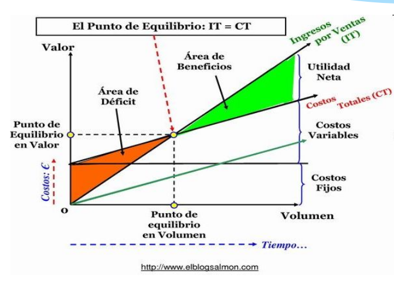

#### Costos de Servicios

Un servicio es intangible, no se puede almacenar, no es transportable, el cliente es el busca el servicio, se consume con la interacción del servicio y son percederos al momento que se utilizan.

Empresas de servicios
- Orientadas a brindar servicios especificos. Estudios juridicos, Contables
- Orientados a brindar servicios integrados. Bancos, Seguros, Transporte, Salud.

Empresas intensivas en capital intelectual.
    - El producto principal es la _venta de información_

Empresas intensivas en capital financiero.
    - Bancos, seguros, financieras

Formas de **Calculo de costos de servicio**

- Sistemas por **ordenes de trabajo**.
    1. Consiste en la generación de servicios heterogeneos a la medida del cliente.
    2. Los costos se acumulan por pedidos.
    3. Existe una identificacion por cada orden de trabajo.
    4. Ejemplos: Auditoria, mantenimiento de impresoras.
- Sistemas por **ordenes de procesos**.
    - Los costos de producción se acumulan por  deptartamento o sector, se aplica a prestadores de servicios homogenos, servicios de naturaleza.
    Ejemplos: Servicios publicos. Medicina prepaga. 

----
### La cuadricula (Matt Watkinson)

Permite realizar una analisis 360 que sirve para la toma de desiciones.
* Instrumento para la doma de decisiones.
* Identificar problemas y oportunidades.
* Trata a la empresa como un sistema unico e interconectado.
* Empresa como unico sistema
* Permite evaluar ideas o productos de forma global
* No se puede determinar su comportamiento mirando solo una parte

#### Estructura de la cuadricula

_METAS_:
- Desabilidad: Que el producto sea deseado
- Rentabilidad: Que el producto genere rentabilidad.
- Continuidad: Ocurra a lo largo del tiempo

y se cursan con _CAPAS DE CAMBIO_:

- Clientes 
- Mercado
- Organización

#### Celdas:

- _Deseo y necesidades_: Son valores y creencias. El objetivo es satisfacer a los cientes.
    - Objetivos
        - Subobjetivo: Metas que conduce a un comportamiento.
        - Subtexto: Lo que piensa el cliente y no lo dice
        - Criterio de satifacción: Como sabemos si los clientes estan contentos.
    - Obstabulos
        - operacionales
        - experiencia
        - financiera 
- _Rentabilidad y Ingresos_ : Ingresos
    - **Modelo de ingresos**: Royalties, Precio Fijo, Suscripcion, Pago por uso. Debe dar beneficio.
    - **Precio**: Debe ser el valor óptimo. El precio se fija mirando el mercado.
    - **Volumen**: Igual a la cantidad por frecuencia de compra.
- _Continuidad y Clientes_: artera de clientes
    - Conocimiento: Es vital conocer y mantener el recuedo de la **marca**. Los clientes deben ser facilmente entendible y lo conoscan.
    - Captación: Que los clientes compren el producto.
    - Retención: Los clentes deben volver a comprar el producto. O sea retener a los clientes. Personal, programas de loyalti.
- _Desabilidad y Mercado_: Rivalidad
    - Categoria: El cliente tiene que tener en claro en que cateria esta.
    - Territorio: A que territorio fisico o segmento apunta el producto.
    - Alternativas y sustitutos: Quienes son los competidores.
- _Rentabilidad y Marcado_:Capacidad Negociadora
    - Relacion con clientes
    - Relación con proveedores: lo mas valioso no es el dinero sino el poder.
        - Cuanto mas compras mas poder tenes.

    - Normas y disposiciones
        - Pueden afectar las necesidades de los cliente.
- _Continuidad y Mercado_: Imitabilidad
    - Protección legal
    - Ventajas duraderas
        - Cuanto mas dificil sea imitar el producto.
    - Retraso de la competencia
- _Organizacion y Deseabilidad_: Ofertas
    - Propuesta: Tiene que superar a los rivales.
    - Atractivo de marca: Se honra a algo o a alqunos
    - Experencia del cliente: Puntos de contacto de los clietes con la empresa.
- _Organización y Rentabilidad_ : Costos
    Los costos tiene que ser monitoreados regularmente.
    - Costos fijos
    - Costos variables
    - Gastos de capital: Realizar inversiones para poder bajar los costos. 
    Al decidir sobre a estructura de costos hay que analizar el impacto en otras celdas de la grilla.
- Organizacion y Continuidad: Adaptibilidad
    - Posición de caja
    - Escalabilidad: El negocio debe crecer y dejar de crecer.
    - Complejidad y rigidez: Evaluar la estructura de la empresa.
---

## Riesgos

Apuntes
    
---
## Calidad

La calidad está asociada con la satisfacción de algien/algunos.

> Segun Kotler, tenemos que definir la necesidad, deseo y la demanda.

**Perpectiva de la calidad**:

1. Cumplir con los requerimientos. _(Crosby)_
2. Cumplir con los requerimientos de alguna persona. _(Weinberg)_
    - Calidad es valor para alguna persona. Lo que es calidad para uno, no es calidad para otro.
3. Adecuación al uso (Juran)
    - Satisfacción de las necesidades del cliente. Utilizarlo para lo que fue diseñado el producto. No puede haber deficiencas.

> **Definición de Calidad**: Totalidad de aspectos y caracteristicas de un producto y servicio que se sustentan en su capacidad de cumplir las necesidades especificas o implicitas. _(ISO 8402 - 1986)_

**Principios de Calidad**:

1. La calidad no se inyecta ni se compra. 
2. La calidad se prevé y se diseña. Se diseña bien de entrada. 
3. La admin. de RRHH es importante. La calidad lo construyen las personas y es un proceso de mejora continua. 
    * _Capacidad instalada_: Como la empresa administra la maquinaria y la mano de obra.
    * _Evaluación de desempeño_: Se estudia la capacidad de desempeño para mejorar las personas y mejoren la empresa.
4. Se necesita el apoyo de la gerencia. O sea que viene de arriba hacia abajo. 
5. Se debe liderar con el ejemplo. El gerente debe tener en cuenta la calidad.
6. Controlar la calidad de los componentes generados en las tareas iniciales reduce drasticamente los costos.

**Visiones de calidad**

- **Trasendente**: Ve la calidad como algo se puede reconocer pero no definir. El usuario lo persive. Veo tales recursos tangibles con visión trasendese. Es un ideal. Marca un rumbo
- **Visión De usuario**: 
    - Adecuación al uso (Juran)
    - Basada en las caracteristicas del producto.
    - Depende del contexto de uso.
    - Performance, confiable, usabilidad.
- **Visión de construcción**. Que maqinaria utilizo.
    - Si hacemos un buen proceso, haacemos un buen producto.
- **Visión de producto**:
    - Facilidad de mantenimiento
    - Flexibilidad, ¿Se puede cambiar?
    - Facilidad de prueba?
    - Corrección. ¿hace lo que quiero?
- **Visión Basada en el Valor**: El cliente le da valor al producto y esta dispuesto a pagar. 
    - Se diseña contra el costo. Alquien puede pagar un precio alto y otros pueden pagar un diseño mas barato. 
    - Costo versus valor/beneficio

> La falta de calidad cuesta.

### SEIS SIGMA
Enfocado en el clientes, produce grandes grandes retornos de inversión. Cambia el modo en que opera la dirección.

- **Metamorfirmos**: 
    1. _Interes en el cliente_: (no en los procesos) Pensar en el cliente y satisfacer al cliente pero vinculado al uso. Preguntar que necesita el cliente.
    2. _Cliente / Proveedor interno_: El cliente va a ver directamente al proveedor interno que va a resolver la necesidad.
    3. _Producir mejor de entrada_: Detectar los defectos en el proceso.
    4. _Empresas multicelular_ - Equipos reponsables asumen misiones. Trabajo de equipo decentralizado.
    5. _Relaciones de confianza con proveedores y entre proveedores_.
    6. Sustituir _control_ por _prevención_: En vez de controlar lo que salio, diseñemos bien de entrada, o sea en el proceso.
    7. _Eliminación de desperdicios_ : no solo en producción sino tambien en administración

**6Sigma** es estadistico. Los esfuerzos se centran en:
* Mejorar la satisfacción del cliente
* Reducir el tiempo del ciclo. 
* Reducir los defectos

**6 Prinicipios**:

1. Enfoque genuino en el cliente. 
2. Dirección basada en datos y hechos (atacar causas y no síntomas). Encontrar causa raiz de un problema utilizando los datos historicos.
3. Los procesos estan donde esta la acción. El proceso esta en la fabricacion y control del proceso productivo. No solo en la comercialización.
4. _Dirección proactiva_ (metas, prioridades, prevención y cuestionamiento permanentes). Que esta pasando, donde estoy? se esta cumpliendo lo que tenemos planeado?
5. _Colaboración sin barreras_ (trabajo en equipo).
6. _Buscar la perfección_. Calidad total de la organización.

----
Libro: Globalizando desde latinoamerica Arcor
 
